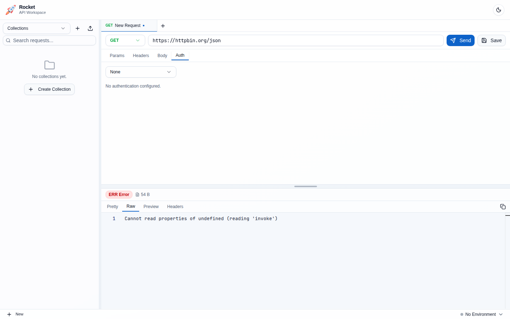
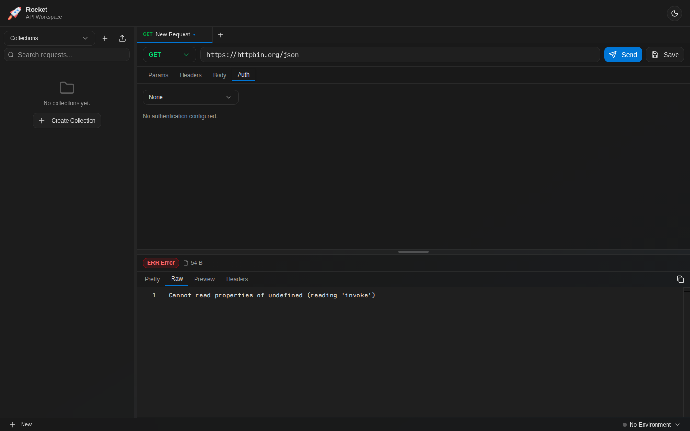

# Rocket User Manual

Rocket is a fast, native API client for testing and debugging HTTP APIs. Built with Tauri, it runs on Linux, macOS, and Windows.

## Table of Contents

- [Getting Started](#getting-started)
- [Request Builder](#request-builder)
- [Query and Path Parameters](#query-and-path-parameters)
- [Headers](#headers)
- [Request Body](#request-body)
- [Authentication](#authentication)
- [Response Viewer](#response-viewer)
- [Collections](#collections)
- [Environments](#environments)
- [Keyboard Shortcuts](#keyboard-shortcuts)

---

## Getting Started

When you first launch Rocket, you see the main workspace with a request tab open. The interface has three main areas: the collections sidebar on the left, the request editor in the center-top, and the response viewer in the center-bottom.

| Light Mode | Dark Mode |
|:---:|:---:|
|  |  |

---

## Request Builder

The request builder sits at the top of the main workspace. Select an HTTP method (GET, POST, PUT, PATCH, DELETE, OPTIONS, HEAD) from the dropdown, type your URL, and click **Send** or press `Cmd+Enter`.

| Light Mode | Dark Mode |
|:---:|:---:|
|  |  |

---

## Query and Path Parameters

The **Params** tab shows query parameters extracted from the URL. Editing parameters here automatically updates the URL bar, and vice versa. Path parameters (e.g., `:id` in `/users/:id`) are shown separately at the top.

Toggle the checkbox next to any parameter to enable or disable it without deleting it.

| Light Mode | Dark Mode |
|:---:|:---:|
|  |  |

---

## Headers

The **Headers** tab lets you add custom request headers. Each header has a key, value, and enabled toggle. Common headers like `Content-Type` and `Authorization` are set automatically based on your body mode and auth settings.

| Light Mode | Dark Mode |
|:---:|:---:|
|  |  |

---

## Request Body

The **Body** tab supports multiple content types:

- **JSON** — Full Monaco editor with syntax highlighting, code folding, and bracket matching.
- **XML** — Monaco editor with XML syntax support.
- **Text** — Plain text editor.
- **Form Data** — Key-value pairs sent as `multipart/form-data`.
- **Binary** — File upload from your local filesystem.
- **None** — No request body (default for GET requests).

| Light Mode | Dark Mode |
|:---:|:---:|
|  |  |

---

## Authentication

The **Auth** tab supports multiple authentication methods:

- **None** — No authentication.
- **Basic** — Username and password, sent as a Base64-encoded `Authorization` header.
- **Bearer** — Token-based auth with a configurable prefix.
- **API Key** — Custom key-value pair added to headers or query parameters.
- **OAuth 2.0** — Supports Client Credentials, Password, and Authorization Code flows with PKCE. Includes token refresh.
- **AWS Signature V4** — Signs requests with your AWS access key, secret, region, and service.

Collections can define default auth that applies to all requests unless overridden.

| Light Mode | Dark Mode |
|:---:|:---:|
|  |  |

---

## Response Viewer

After sending a request, the response panel shows:

**Status bar** with color-coded indicators:
- Status code badge (green for 2xx, yellow for 3xx, red for 4xx/5xx)
- Response time with color coding (green <=200ms, yellow 200-1000ms, red >1s)
- Response size

**Tabs:**
- **Pretty** — Formatted response body in a read-only Monaco editor with syntax highlighting.
- **Raw** — Unformatted response body.
- **Preview** — HTML preview rendered in a sandboxed iframe.
- **Headers** — Searchable response headers table with copy-to-clipboard.

| Light Mode | Dark Mode |
|:---:|:---:|
|  |  |

### Raw Response

| Light Mode | Dark Mode |
|:---:|:---:|
|  |  |

### Response Headers

| Light Mode | Dark Mode |
|:---:|:---:|
|  |  |

---

## Collections

The left sidebar organizes your API requests into collections. Each collection is a folder on disk at `~/.rocket-api/collections/`.

Features:
- **Create** collections and folders via right-click context menu or the `+` button.
- **Drag and drop** requests between folders and collections.
- **Rename** items inline by double-clicking.
- **Delete** with confirmation dialog.
- **Collection settings** — define shared auth and headers that apply to all requests in the collection.
- **Auto-save** — changes to collection-owned requests are saved automatically with debouncing.

| Light Mode | Dark Mode |
|:---:|:---:|
|  |  |

---

## Environments

Environments let you define variables (like `BASE_URL`, `API_KEY`) that are resolved in URLs, headers, body content, and auth fields using `{{variable}}` syntax.

- Switch environments from the dropdown in the header bar.
- Variables can be marked as **secret** to hide their values in the UI.
- Each environment is stored as a JSON file at `~/.rocket-api/environments/`.

| Light Mode | Dark Mode |
|:---:|:---:|
|  |  |

---

## Keyboard Shortcuts

| Shortcut | Action |
|----------|--------|
| `Cmd+Enter` | Send request |
| `Cmd+T` | New tab |
| `Cmd+W` | Close tab |
| `Cmd+S` | Save request to collection |
| `Cmd+1-9` | Switch to tab N |
| `Cmd+Shift+T` | Reopen closed tab |

---

*This manual is auto-generated. Run `yarn manual` to regenerate screenshots.*
