# Rocket User Manual

Rocket is a fast, native API client for testing and debugging HTTP APIs. Built with Tauri 2, it runs on Linux, macOS, and Windows. Your data stays on your machine — no cloud, no account.

## Table of Contents

- [Getting Started](#getting-started)
- [Workspaces](#workspaces)
- [Collections](#collections)
- [Creating Requests](#creating-requests)
- [Request Builder](#request-builder)
- [Query and Path Parameters](#query-and-path-parameters)
- [Headers](#headers)
- [Request Body](#request-body)
- [Authentication](#authentication)
- [Response Viewer](#response-viewer)
- [Environments](#environments)
- [Git Integration](#git-integration)
- [Load Testing](#load-testing)
- [Themes](#themes)
- [Keyboard Shortcuts](#keyboard-shortcuts)

---

## Getting Started

When you first launch Rocket, a default workspace is created at `~/.rocket-api/My Workspace/`. The interface has three main areas:

- **Collections sidebar** (left) — browse and manage your API collections
- **Request editor** (center-top) — build and send HTTP requests
- **Response viewer** (center-bottom) — inspect responses

The **Collection Dropdown** above the tab bar shows your current context. Click the workspace name to return to the workspace overview. Click a collection name to switch between collections.

| Light Mode | Dark Mode |
|:---:|:---:|
| 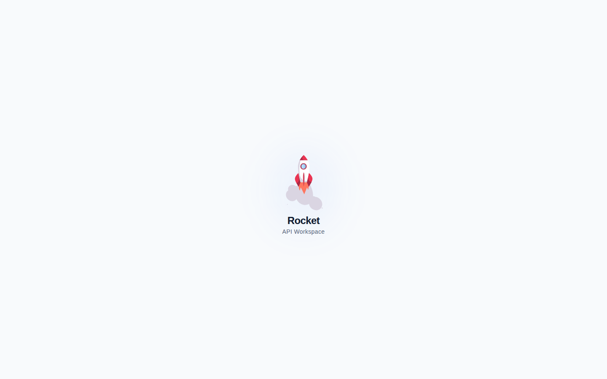 | 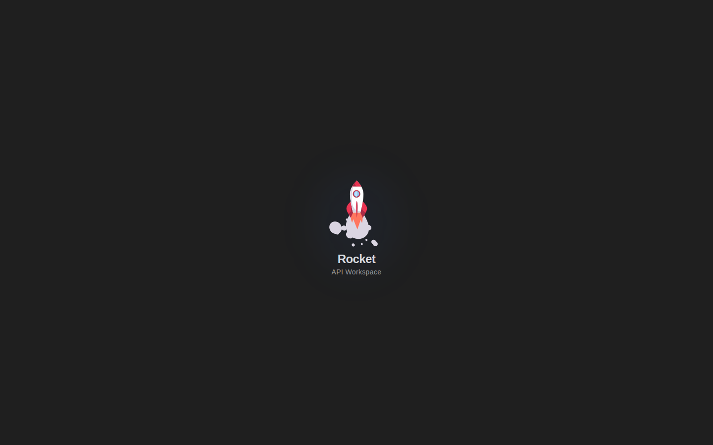 |

---

## Workspaces

A workspace is a container for collections, environments, and settings. Each workspace is a folder on disk.

### Workspace Overview

Click the workspace name in the Collection Dropdown (or open the Overview tab) to see:

- **Stats** — collection count, environment count, total request count
- **Quick actions** — Create Collection, Open Collection (link external folder)
- **Collections list** — each collection with its path, request count, and type badge
- **Description** — editable text area for notes

| Light Mode | Dark Mode |
|:---:|:---:|
|  |  |

### Creating a Workspace

1. Open the workspace switcher in the title bar
2. Click **New Workspace**
3. Enter a name — the folder path defaults to `~/.rocket-api/<name>/`
4. Click **Create**

### Switching Workspaces

Use the workspace switcher dropdown in the title bar. The active workspace is indicated with a checkmark. Pinned workspaces appear at the top.

---

## Collections

Collections organize your API requests into folders. Each collection is a directory on disk containing `.yml` request files in OpenCollection format.

### Creating a Collection

From the **Workspace Overview**, click **Create Collection** and type a name. Or use the `+` button in the sidebar toolbar.

### Collection Tree

The sidebar shows your collections as an expandable tree:

- **Single-click** a collection to expand/collapse it
- **Double-click** a collection to open its Overview tab (settings, auth, variables, readme, tags)
- **Right-click** for context menu: New Request, New Folder, Rename, Delete
- Click the `...` menu on any collection for the same actions

### Collection Settings

Double-click a collection to open its settings tabs:

- **Overview** — description and name
- **Authorization** — default auth applied to all requests (overridable per request)
- **Variables** — collection-scoped variables
- **Readme** — markdown documentation with edit/preview toggle
- **Tags** — aggregated view of all tags across requests

| Light Mode | Dark Mode |
|:---:|:---:|
| 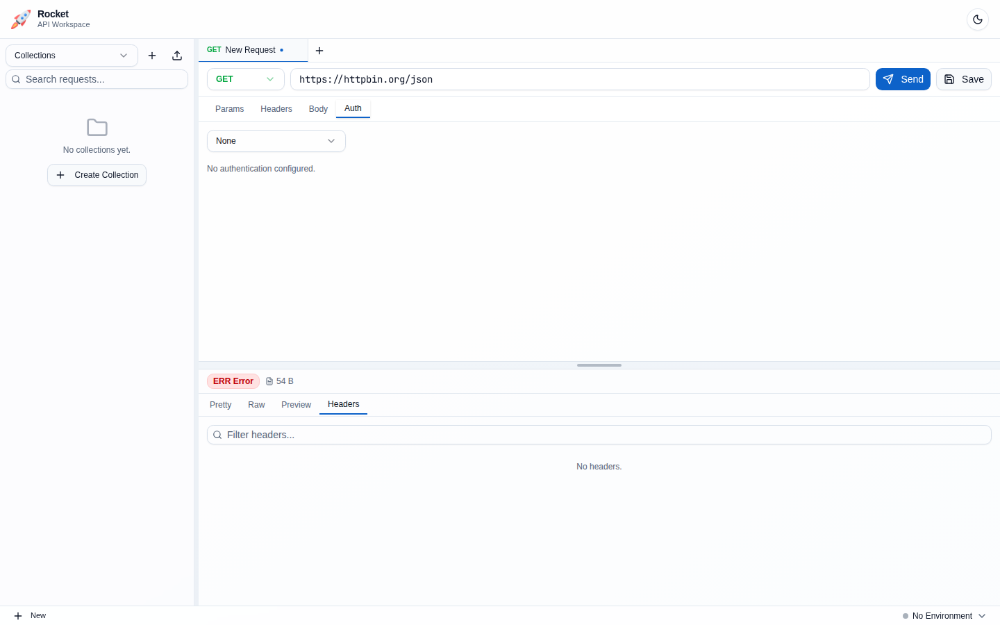 | 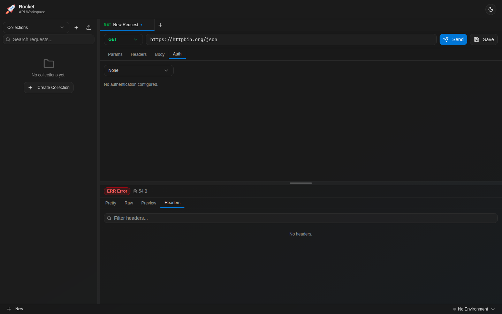 |

---

## Creating Requests

There are three ways to create a request:

### 1. From the Collection Menu

Click the `...` button on any collection or folder, then **New Request**. A dialog opens where you can set:

- **Request Type** — HTTP, GraphQL, gRPC, WebSocket, or From cURL
- **Request Name** — display name (unsafe filesystem characters are auto-sanitized)
- **HTTP Method** — GET, POST, PUT, PATCH, DELETE, OPTIONS, HEAD
- **URL** — pre-fill the endpoint

The request is saved to disk immediately and opens in a new tab.

| Light Mode | Dark Mode |
|:---:|:---:|
|  |  |

### 2. Quick New Tab (`+` button)

Click the `+` button at the end of the tab bar:

- **Left-click** creates an instant HTTP request tab (no dialog, no disk file)
- **Right-click** opens a menu to choose: HTTP, GraphQL, gRPC, or WebSocket

These "ephemeral" tabs are not yet saved to any collection. A **Save to Collection** button appears in the toolbar. Press `Cmd/Ctrl+S` to open the Save dialog.

### 3. Sidebar `FilePlus` Button

Click the `FilePlus` icon in the sidebar toolbar. Same as `+` left-click — creates an instant ephemeral HTTP tab.

### Saving Ephemeral Requests

When viewing an unsaved request:

1. Click **Save to Collection** in the toolbar (or press `Cmd/Ctrl+S`)
2. Choose an existing collection or create a new one
3. Enter a request name
4. Click **Save**

The tab becomes a saved, collection-bound request with auto-save enabled.

| Light Mode | Dark Mode |
|:---:|:---:|
|  |  |

---

## Request Builder

The request builder sits at the top of the editor. Select an HTTP method from the dropdown, type your URL, and click **Send** or press `Cmd/Ctrl+Enter`.

The URL bar supports:

- **Path parameters** — type `:paramName` and values appear in the Params tab
- **Variable highlighting** — `{{variable}}` tokens are visually highlighted
- **Query parameters** — `?key=value` pairs are parsed into the Params tab

| Light Mode | Dark Mode |
|:---:|:---:|
| 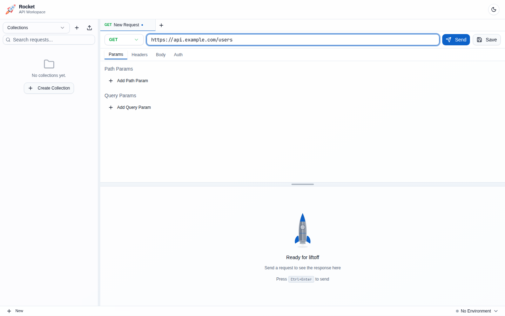 | 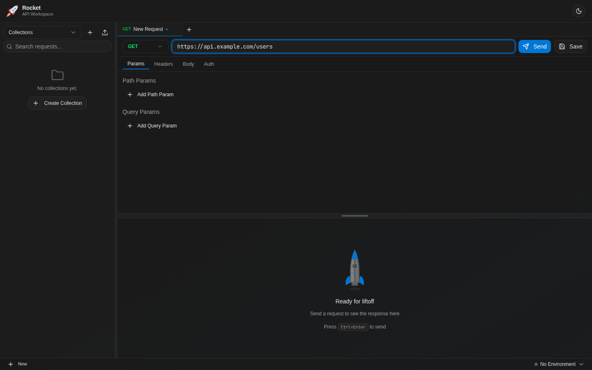 |

---

## Query and Path Parameters

The **Params** tab has two sections:

### Path Parameters

Auto-extracted from `:param` segments in the URL. Keys are read-only (they come from the URL structure). Only values and the enable/disable toggle are editable. No add/remove buttons — modify the URL to change path params.

### Query Parameters

Full add/remove/toggle capability. Each parameter has a name, value, and enabled checkbox. Editing parameters here automatically updates the URL bar, and vice versa.

| Light Mode | Dark Mode |
|:---:|:---:|
| 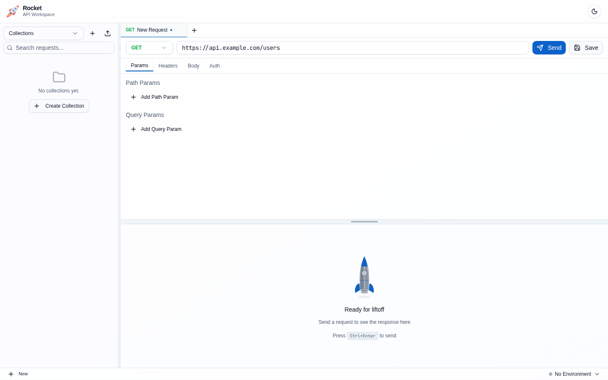 | 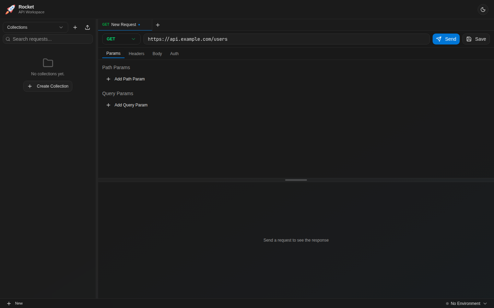 |

---

## Headers

The **Headers** tab shows a table with column headers (Name, Value) and each header has an enable/disable checkbox. Common headers like `Content-Type` and `Authorization` are set automatically based on your body mode and auth settings.

| Light Mode | Dark Mode |
|:---:|:---:|
| 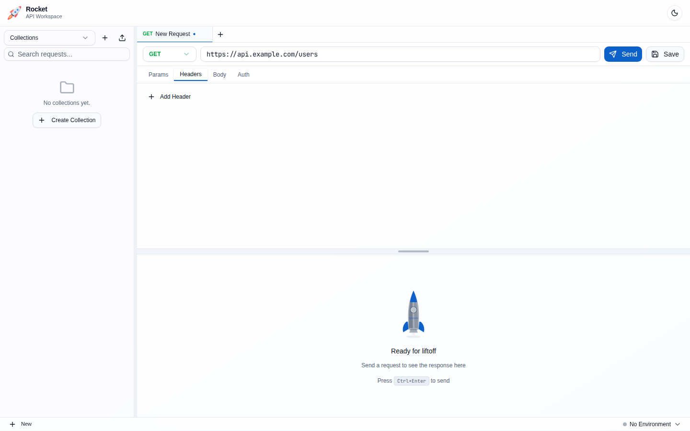 | 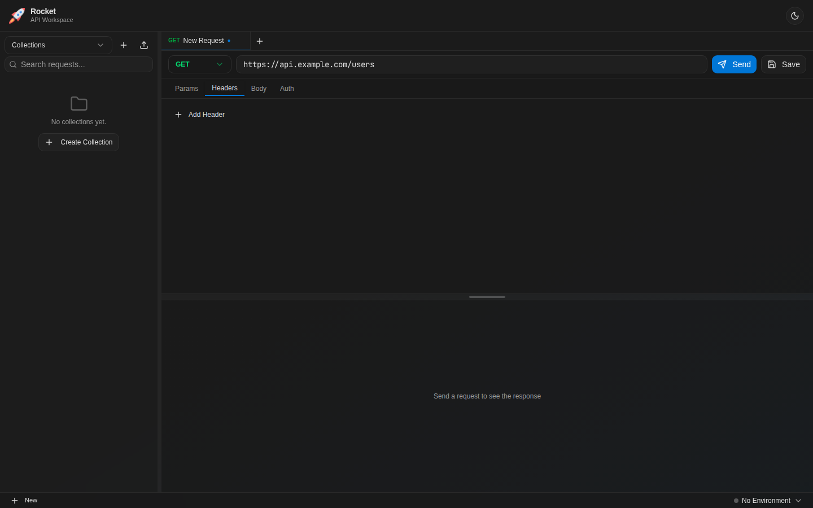 |

---

## Request Body

The **Body** tab supports multiple content types:

- **JSON** — Full Monaco editor with syntax highlighting, code folding, and bracket matching
- **XML** — Monaco editor with XML syntax support
- **Text** — Plain text editor
- **Form Data** — Key-value pairs sent as `multipart/form-data`
- **Binary** — File upload from your local filesystem
- **None** — No request body (default for GET requests)

| Light Mode | Dark Mode |
|:---:|:---:|
| 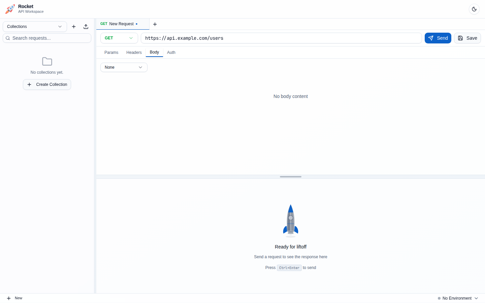 | 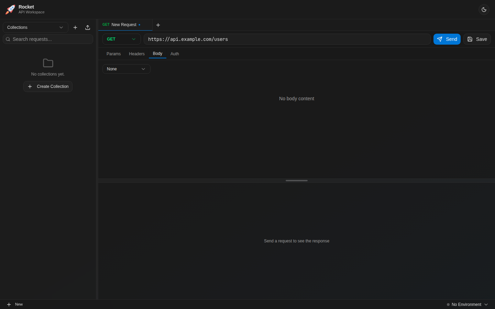 |

---

## Authentication

The **Auth** tab supports multiple authentication methods:

- **None** — No authentication
- **Basic** — Username and password, sent as a Base64-encoded `Authorization` header
- **Bearer** — Token-based auth with a configurable prefix
- **API Key** — Custom key-value pair added to headers or query parameters
- **OAuth 2.0** — Supports Client Credentials, Password, and Authorization Code flows with PKCE
- **AWS Signature V4** — Signs requests with your AWS access key, secret, region, and service

Collections can define default auth that applies to all requests unless overridden at the request level.

| Light Mode | Dark Mode |
|:---:|:---:|
| 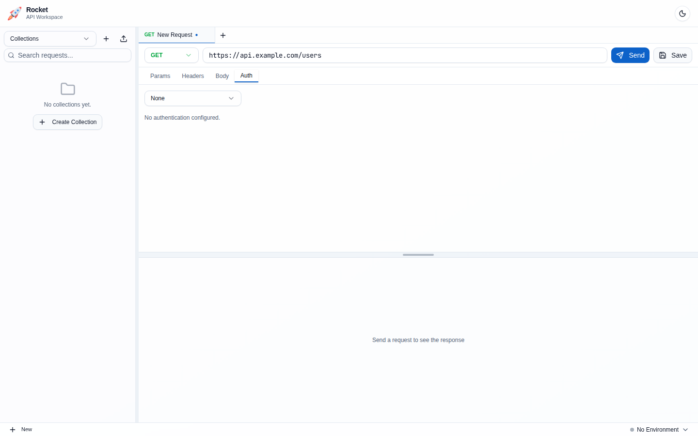 | 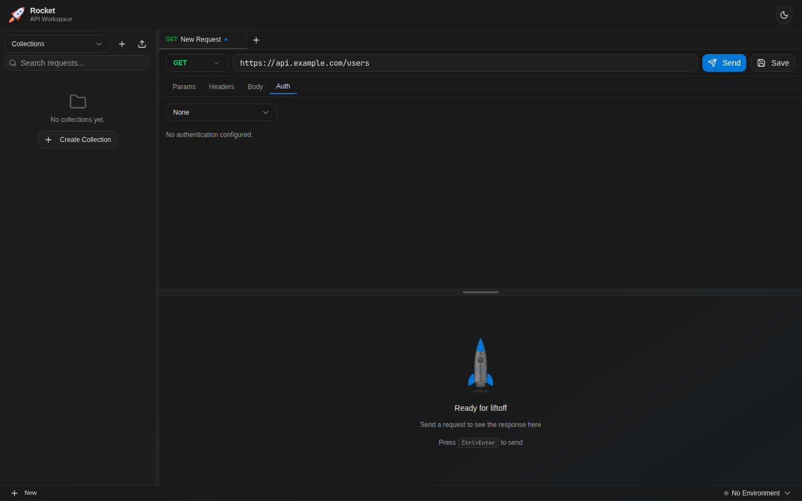 |

---

## Response Viewer

After sending a request, the response panel shows:

**Status bar** with color-coded indicators:
- Status code badge (green for 2xx, yellow for 3xx, red for 4xx/5xx)
- Response time (green <=200ms, yellow 200-1000ms, red >1s)
- Response size

**Tabs:**
- **Pretty** — Formatted response body in a read-only Monaco editor
- **Raw** — Unformatted response body
- **Preview** — HTML preview in a sandboxed iframe (Safe mode by default, Developer mode available)
- **Headers** — Searchable response headers table with copy-to-clipboard

| Light Mode | Dark Mode |
|:---:|:---:|
| 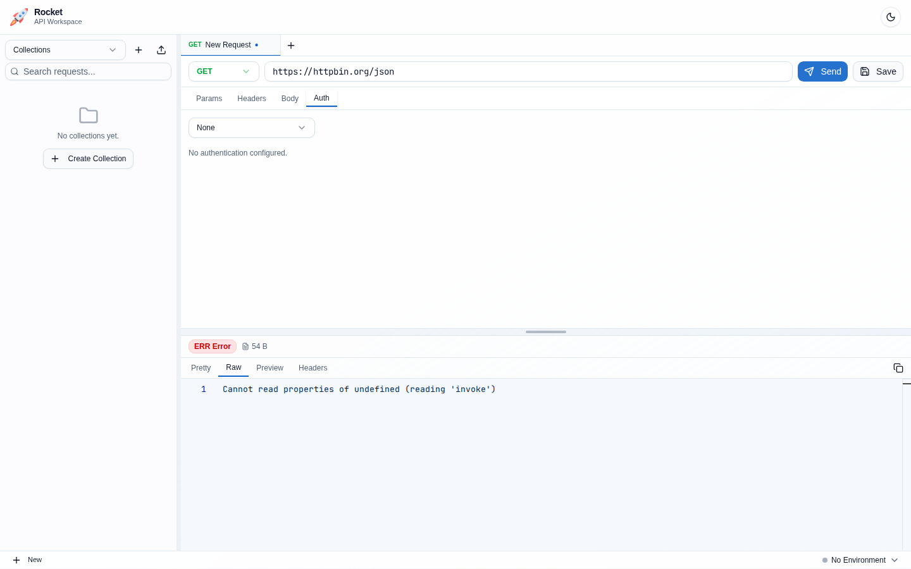 | 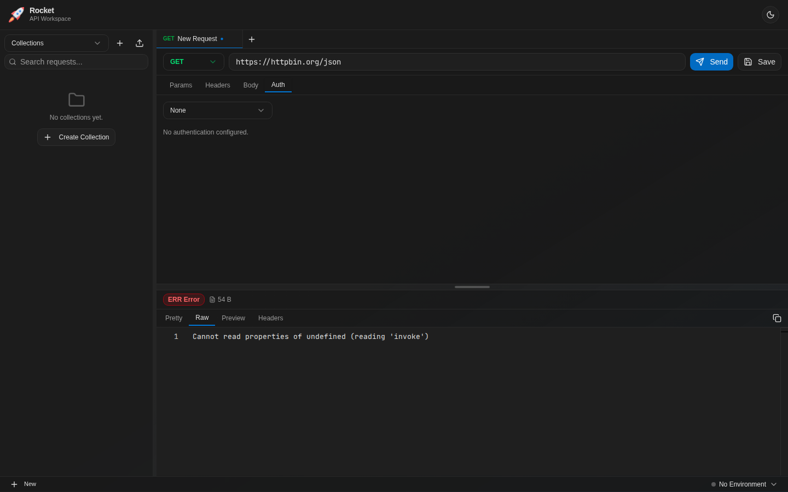 |

---

## Environments

Environments let you define variables (like `BASE_URL`, `API_KEY`) that are resolved in URLs, headers, body content, and auth fields using `{{variable}}` syntax.

- Switch environments from the dropdown in the header bar
- Variables can be marked as **secret** to hide their values in the UI
- Environment variables override collection variables when both define the same key
- Each environment is stored as a YAML file in the workspace's `environments/` directory

| Light Mode | Dark Mode |
|:---:|:---:|
|  |  |

---

## Git Integration

Rocket has built-in git support for version-controlling your collections. Open the **Git UI** tab from the workspace tabs or the git toolbar button.

| Light Mode | Dark Mode |
|:---:|:---:|
|  |  |

### Two-Panel Layout

- **Left panel** (resizable) — file list with staged/unstaged changes, commit form, branch selector
- **Right panel** — landing overview, file diffs, commit history, or stashes

### Staging and Committing

1. Changed files appear in the **Unstaged Changes** section
2. Click `+` to stage individual files, or the header `+` to stage all
3. Staged files move to the **Staged Changes** section (shown above unstaged)
4. Write a commit message and click **Commit**

Use the trash icon to discard changes, or `-` to unstage files.

### Branches

Click the branch name in the left panel header to:

- **Switch** to any local branch
- **Create** a new branch
- **Delete** or **merge** branches
- **Checkout remote branches** — after fetching, remote branches appear in a "Remote" section. Clicking one creates a local tracking branch and switches to it.

| Light Mode | Dark Mode |
|:---:|:---:|
|  |  |

### Remote Operations

The landing panel shows **Fetch**, **Pull**, and **Push** buttons with commit counts:

- **Fetch** retrieves all remote refs and refreshes the branch list
- **Pull** with auto-stash prompt when working tree is dirty
- **Push** with fetch-before-push safety prompt

### Diff Viewer

Click any changed file to see a side-by-side diff with:

- **Text mode** — Monaco diff editor
- **Visual mode** — structured field-by-field comparison (for YAML request files)
- Toggle between **Working** and **Staged** views

A breadcrumb header shows the file path with a **"back to Overview"** button.

| Light Mode | Dark Mode |
|:---:|:---:|
|  |  |

### Conflict Resolution

When merge conflicts occur, a conflict resolver shows **Ours** vs **Theirs** side-by-side with options to accept either side or edit manually.

---

## Load Testing

Rocket includes a built-in load testing feature for stress-testing APIs.

### Running a Load Test

1. Open any request in the editor
2. Click the **Zap** icon next to the Send button
3. Configure:
   - **Concurrent requests** — 1, 5, 10, 25, 50, or 100
   - **Total requests** — how many to send (default: 100)
4. Click **Run**

### Results

After completion, the dialog shows:

- **Counts** — total, succeeded, failed
- **Latency** — min, avg, max, P50, P95, P99
- **Throughput** — requests per second
- **Duration** — total wall-clock time

| Light Mode | Dark Mode |
|:---:|:---:|
|  |  |

---

## Themes

Rocket supports light and dark themes. Toggle using the **Sun/Moon** icon in the bottom-left corner of the status bar. The theme preference is persisted across sessions and syncs with the system preference on first launch.

The Monaco editor uses custom `rocket-light` and `rocket-dark` themes that match the app's color scheme.

---

## Keyboard Shortcuts

| Shortcut | Action |
|---|---|
| `Cmd/Ctrl+Enter` | Send active request |
| `Cmd/Ctrl+S` | Save request (or Save to Collection if unsaved) |
| `Cmd/Ctrl+W` | Close active tab |
| `Cmd/Ctrl+Tab` | Next tab (wraps) |
| `Cmd/Ctrl+Shift+Tab` | Previous tab (wraps) |
| `Cmd/Ctrl+1-9` | Jump to tab by index |

---

## Data Storage

All data is stored locally on your filesystem:

```
~/.rocket-api/
  workspaces.yml              # Workspace registry
  <workspace-name>/
    workspace.yml              # Workspace config
    collections/               # Collection directories with .yml request files
    environments/              # Environment .yml files
    history/                   # Request execution history
    cookies/                   # Cookie jars
    templates/                 # Saved request templates
```

No data is ever sent to the cloud. Share collections with your team via git.
