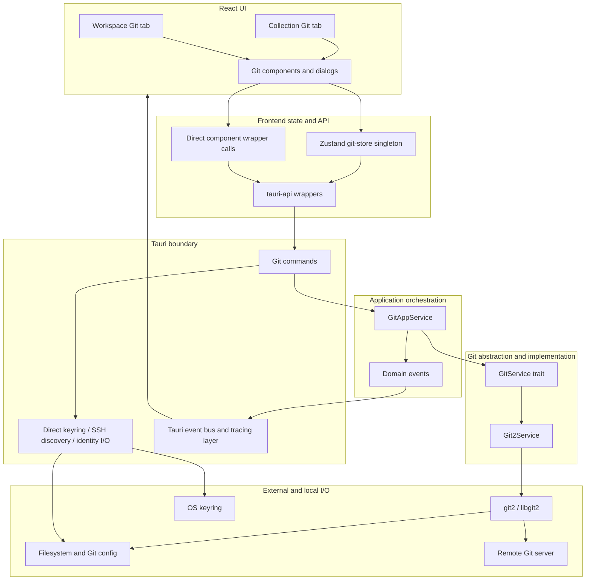

# Git UI and Integration Audit — Consolidated Management Report

**Audit date:** 2026-09-19
**Decision status:** Remediation required before the Git integration should be treated as safe for destructive or security-sensitive workflows
**Audience:** Engineering, product, security, QA, and delivery owners

## Contents

- [1. Scope, evidence, and limitations](#1-scope-evidence-and-limitations)
- [2. Executive assessment](#2-executive-assessment)
- [3. Current user journey](#3-current-user-journey)
- [4. Architecture and data flow](#4-architecture-and-data-flow)
- [5. Deduplicated executive gap summary](#5-deduplicated-executive-gap-summary)
- [6. Prioritized backlog](#6-prioritized-backlog)
- [7. Phased implementation plan](#7-phased-implementation-plan)
- [8. Test matrix and commands](#8-test-matrix-and-commands)
- [9. KEEP decisions and rejected over-broad refactors](#9-keep-decisions-and-rejected-over-broad-refactors)
- [10. Source reports](#10-source-reports)

## 1. Scope, evidence, and limitations

### Scope

This report consolidates the six Git integration reviews into one end-to-end management view. The audited path includes:

- collection and workspace entry points, pane/tab behavior, and all `src/components/git/*` workflows;
- Zustand ownership and action behavior in `src/stores/git-store.ts`;
- TypeScript wrappers in `src/lib/tauri-api.ts`;
- all 39 registered Git-related Tauri commands, command DTOs, keyring access, SSH-key discovery, identity handling, and event mapping;
- `GitAppService`, domain-event publication, and orchestration contracts;
- the `GitService` trait and `Git2Service`/libgit2 implementation;
- repository status, diff, stage, unstage, discard, commit, branch, remote, clone, fetch, pull, push, stash, conflict, and abort behavior;
- existing frontend, application, Tauri, and `rocket-git` tests and current logging/event observability.

The review was performed against the architecture and repository rules in `CLAUDE.md`, `crates/rocket-app/CLAUDE.md`, and `crates/rocket-git/CLAUDE.md`.

### Evidence standard

Findings use the following evidence levels:

1. **Reproduced defect:** observed with an executable temporary-repository audit probe or existing deterministic test. Examples include out-of-repository read/delete, staged-content loss during discard, differing untracked-file overwrite during pull, delete-side conflict corruption, abort outside a merge destroying work, and incorrect diff/symlink behavior.
2. **Confirmed by unconditional code path/API contract:** the implementation necessarily has the described behavior, even where no separate reproduction was run. Examples include unconditional certificate acceptance, duplicate clone invocation, and frontend actions resolving after caught errors.
3. **Statically inferred risk:** credible impact depends on timing, platform, repository shape, injected failure, renderer compromise, or transport behavior. These are labeled as risks rather than represented as reproduced production incidents.
4. **Feature/UX or test gap:** behavior is missing, ambiguous, inaccessible, or insufficiently verified, rather than proven to violate an existing safe contract.

Severity means:

- **Critical:** credible arbitrary file access, remote impersonation, wrong-repository mutation, or severe data-loss path.
- **High:** a core journey is blocked, falsely reports success, loses user input/work, or lacks necessary recovery.
- **Medium:** material reliability, maintainability, accessibility, or diagnostic weakness with bounded immediate impact.
- **Low:** hardening or fidelity work with limited immediate impact.

Confidence is based on the reviewed evidence, not on production telemetry. Source-report line references are useful navigation aids but **can drift as source files change**; stable finding IDs and linked report sections should be treated as the durable citation.

### Limitations

- This was primarily a static, end-to-end code review, supplemented by focused existing test runs and a temporary 10-case `rocket-git` audit probe. It was not a production incident review.
- No external real-host SSH/TLS matrix, native desktop end-to-end suite, or multi-platform keychain/agent test was completed.
- The renderer-compromise security analysis intentionally treats Tauri IPC as an authority boundary. It does not assume normal UI controls prevent direct invocation.
- No production code or source report was changed as part of this consolidation.
- Passing baselines do not validate the critical cross-layer journeys. In particular, mocked store tests do not exercise Tauri dispatch, real repository state, or component behavior.

## 2. Executive assessment

The Git feature is broadly wired and exposes most expected operations, but it is not yet safe or consistently truthful end to end. Three issue clusters dominate management risk:

1. **Security and filesystem authority:** remote identity verification is disabled, renderer-provided repository/file paths can escape repository boundaries, and reusable credentials cross into long-lived renderer state.
2. **Data integrity and operation truthfulness:** forced checkout, discard, conflict resolution, and abort paths can destroy or corrupt work; ordinary `Result<()>`/`Promise<void>` contracts hide conflict or partial mutation; frontend callers continue safety chains after a failed prerequisite.
3. **Repository ownership and integration confidence:** a singleton mutable Git store can mix or mutate different collection/workspace repositories, while the most consequential UI → IPC → app → git2 workflows have no vertical tests.

The lowest backend layer has useful happy-path coverage, but the overall test pyramid is inverted. The immediate objective should be a **fail-closed safety contract**, not new Git features.

### Recommended release posture

- Treat path escape and unconditional remote trust as **P0 security remediation**.
- Do not rely on current discard, remote checkout, abort, or stale conflict controls for lossless behavior.
- Do not describe fetch/pull/push, commit, remote edits, or chained safety workflows as successful based only on fulfilled frontend promises.
- Keep broader fidelity work—proper hunks, tags, rebase, signing, amend, force-with-lease—behind the security, data-loss, typed-outcome, and repository-scoping work.

## 3. Current user journey

### 3.1 Entry and repository scope

#### Collection Git tab

1. The collection dropdown selects an active collection and usually calls `setCollection(summary.path)`.
2. The global Git toolbar button and `Cmd/Ctrl+Shift+G` are available only when an active collection exists.
3. Opening Git creates a path-bearing `GitTab` labeled with the collection name.
4. `EditorGroup` renders `GitPanel` using that tab’s path and name.
5. There is no repository selector inside the panel; the supplied path is the effective scope.
6. A stale-path defect exists: the toolbar prefers the singleton Git store’s existing path before resolving the active collection. Breadcrumb switching does not always update that store first, so a tab labeled for collection B can carry collection A’s path.

#### Workspace Git tab

1. Selecting a workspace opens Overview, Environments, Git UI, and Audit Log tabs.
2. `WorkspaceGitTab` resolves the workspace path and passes it into the same `GitPanel` through props named `collectionPath`/`collectionName`.
3. Workspace mode clears `activeCollection`, so the global toolbar Git button is disabled even though a workspace Git tab exists.
4. Status, discard, commit, branch, remote, and stash operations apply to the workspace root, but the panel frequently calls that root a “collection.”

#### Cross-scope behavior

Both entry paths mount the same panel and use one global Zustand store. Multiple panes can mount different repository roots, but all state and actions share one mutable `collectionPath`. Late responses and stale panels can therefore display or mutate the wrong repository. This is a statically confirmed race/design defect; the audit did not run a native split-pane reproduction.

### 3.2 Non-repository, initialize, and clone

1. `GitPanel` asks the global store to probe the supplied path.
2. While local panel state is unresolved, it renders a skeleton.
3. A `false` probe renders **Initialize Git** and **Clone Repository**.
4. Initialize calls `git_init` and reloads the path.
5. Clone collects URL/destination and obtains credentials before calling `git_clone`.
6. Clone completion detects workspace, standalone collection, multi-collection, or unknown structure.

Current limitations:

- repository probe errors—including permission/corruption—collapse into “not a repository”;
- Initialize lacks a reliable busy/error state because store failures are swallowed;
- when credentials already exist, clone has two execution owners and can issue two concurrent clone calls;
- credential cancellation can leave the clone screen indefinitely on “Cloning repository...”;
- failed authentication has no in-context credential replacement path;
- standalone and selected multi-collection clones are sent to the workspace-only open API and fail when `workspace.yml` is absent;
- a failed clone may leave a nonempty partial destination that blocks retry.

### 3.3 Status, diff, stage, unstage, and discard

1. A recognized repository loads status, branches, remotes, and stashes in parallel.
2. The left panel groups staged and unstaged rows. A path with both kinds of changes intentionally appears twice.
3. Selecting a row loads staged or working-tree diff content into the right panel.
4. Per-row and all-files stage/unstage actions update the index and refresh status.
5. Discard All asks for confirmation; per-file discard does not.
6. `.yml` files may be shown in text or visual diff modes.

Confirmed backend defects:

- unstaged diff compares `HEAD` → worktree instead of index → worktree;
- discarding the unstaged half of a staged+unstaged file resets both index and worktree to `HEAD`, losing the staged version;
- untracked discard permanently deletes files/directories;
- path traversal can read or delete outside the repository;
- symlink diff follows the target rather than comparing the link value;
- binary/unreadable/invalid UTF-8 states collapse into null/empty text;
- unborn repositories cannot unstage initial files because unstage requires `HEAD`.

### 3.4 Commit and identity

1. Commit is enabled with a nonempty message and staged status.
2. The UI reads repository/global identity before committing.
3. Missing identity opens a dialog; saving writes repository-local Git config and retries commit.
4. Successful commit refreshes status and log.

Current limitations:

- identity I/O is implemented directly in Tauri rather than through application policy;
- inherited identity source is not shown and may be materialized as a local override;
- backend validation is absent and a two-field write can partially succeed;
- store commit failures resolve normally, causing the component to clear the user’s message even when no commit occurred;
- the returned `CommitInfo` is discarded, so success cannot identify the created commit directly.

### 3.5 Branches

The branch selector supports local switch, create-and-switch, merge, delete, and remote-branch checkout.

- Local switch is the strongest existing pattern: it checks tracked dirty state, uses safe checkout, and attempts `HEAD` rollback.
- Remote checkout and branch creation can move refs/`HEAD` before force checkout and lack the same preflight.
- Fast-forward merge paths also force checkout.
- Branch deletion has no merged/unmerged policy or confirmation.
- Detached/unborn states are squeezed into strings (`HEAD` or fallback `main`) rather than explicit states.

A forced-checkout overwrite was reproduced for pull with a differing untracked collision. Equivalent branch/merge paths share the unsafe primitive and are treated as confirmed implementation defects, while exact failure windows remain operation-specific risks until tested.

### 3.6 Remotes, credentials, fetch, pull, and push

1. The landing panel exposes Fetch, Pull, Push, and credential settings.
2. Missing credentials open a shared dialog and store a pending operation for retry.
3. Credentials may be SSH agent, SSH key, username/password, or token and are stored in the OS keychain.
4. Pull with a dirty tree offers Cancel, Pull Anyway, or Stash & Pull.
5. Push may recommend Fetch & Push.
6. A separate remotes dialog supports list/add/edit/remove.

Current limitations:

- no-remote repositories still expose network actions and can invoke a required `remote: String` with runtime `undefined`;
- multi-remote repositories silently use `remotes[0]`; the target is neither selected nor shown;
- pull/push target resolution can reuse an upstream belonging to a different remote than the caller selected;
- TLS/SSH server identity is accepted unconditionally;
- credentials are addressed by caller-provided workspace ID, returned in plaintext to JavaScript, reused across repository/host boundaries, and retained in global/component state;
- failed keychain persistence is hidden when the dialog closes;
- failed fetch can still set “last fetched” and continue to push; failed stash can still continue to pull;
- pull/merge may have already changed refs/index/worktree when an ordinary error is returned;
- all network, keyring, filesystem, and config commands are synchronous and lack operation IDs, cancellation, timeout, or repository mutation locks.

### 3.7 Stash

1. The stash view saves a required message and includes untracked files.
2. Entries support apply, pop, and drop; hover-revealed selection supports batch actions.
3. The store processes batch operations in an order intended to account for positional index changes.

Current limitations:

- drop is irreversible and unconfirmed;
- stash identity is a mutable numeric index, so partial batch failures can leave stale selection referring to another entry;
- untracked-only stash metadata incorrectly reports zero changed files;
- keyboard users cannot reliably initiate hover-only multi-selection;
- partial success is represented only by a global error string.

### 3.8 Conflicts, resolution, and abort

1. A conflicted status row loads conflict entries and opens `ConflictResolver`.
2. Users can accept ours, accept theirs, provide custom text, or abort.
3. Resolution writes selected content, stages the path, and refreshes status/conflicts.
4. After all conflicts disappear, the user must discover that the normal commit form completes the merge.

Confirmed defects:

- resolution does not verify that the path is still an unresolved conflict before writing;
- a missing ours/theirs entry becomes empty text, so repeated resolution can overwrite a file with empty content;
- accepting a deleted side creates an empty regular file instead of deleting it;
- switching conflict files in manual mode can retain the prior file’s text;
- successful resolution leaves the old resolver armed, enabling double submission;
- abort performs an unconditional hard reset and was reproduced destroying dirty tracked work even when no merge was active.

### 3.9 Completion and errors

- Some landing, stash, and conflict views render the shared store error; file, commit, branch, remote, non-repository, log, and ordinary diff paths often do not.
- Most store actions catch errors and fulfill `Promise<void>`, so `await` does not mean success.
- Success feedback is generally absent; status text can report “0 commits ahead” for a dirty tree and zero/zero when no upstream is known.
- Credential-triggered retries bypass component-local progress/timestamp state.
- Errors, events, and logs lack operation correlation and partial-mutation semantics.

## 4. Architecture and data flow



### Intended boundary

The documented repository flow is:

`React → Tauri command → rocket-app use case → domain trait → rocket-infra implementation → filesystem/network`

`GitAppService` correctly depends on `Box<dyn GitService>` and `Box<dyn EventPublisher>`, and startup acts as the composition root.

### Actual boundary exceptions

1. **Concrete I/O in a domain crate:** `Git2Service` and libgit2 filesystem/network behavior live in `rocket-git`, although root architecture rules place concrete I/O in `rocket-infra`.
2. **Tauri commands bypass application policy:** keyring persistence, SSH-key filesystem discovery, and repository identity config are implemented directly in `src-tauri/src/commands/git.rs`.
3. **Renderer paths carry authority:** commands accept absolute repository roots and relative file strings directly instead of resolving an opaque repository identity through a backend locator.
4. **Some components call wrappers directly:** clone, identity, and diff flows partly bypass the store/controller, splitting operation ownership and invalidation.
5. **Domain types leak into IPC concerns:** serialized Git credential/domain types and mirrored Tauri DTOs blur the rule that IPC casing belongs at the IPC boundary.
6. **Events lose meaning at the edge:** Git domain variants collapse into `git-changed`; payloads are ignored or raw paths are used, while some mutations emit no event and a conflict query emits events.
7. **Observability does not complete the flow:** git2 spans exist, but the Tauri tracing bridge forwards events rather than span lifecycle data, so operation fields/duration/outcome are generally unavailable to the frontend.

These exceptions should be corrected incrementally. A wholesale crate move is not a prerequisite for the P0 safety fixes.

## 5. Deduplicated executive gap summary

| Gap | Classification | Severity | Confidence/evidence | Affected layers | User/security impact | Sources |
|---|---|---:|---|---|---|---|
| Remote certificate and SSH host identity are universally accepted | Security vulnerability | Critical | High; unconditional implementation path | git2, Git service, network | Remote impersonation, credential disclosure, malicious fetch/push target | [03 IPC-02](03-ipc-contracts.md#ipc-02--ipc-03--credential-and-remote-trust-boundaries-are-not-represented-safely), [04 GIT-SEC-01](04-orchestration-security.md#git-sec-01--remote-certificatehost-identity-is-accepted-unconditionally), [05 G2-01](05-git2-backend.md#g2-01--remote-server-identity-verification-is-disabled) |
| Renderer-controlled repository/file paths permit repository escape | Security vulnerability | Critical | Reproduced backend read/delete; write path follows directly | React API, Tauri, app boundary, git2, filesystem | Arbitrary local UTF-8 read, overwrite, recursive delete, arbitrary repo config/init/clone scope | [03 IPC-01](03-ipc-contracts.md#ipc-01--repository-and-file-paths-are-unvalidated-authority-bearing-strings), [04 GIT-SEC-02](04-orchestration-security.md#git-sec-02--renderer-controlled-paths-enable-repository-escape-and-arbitrary-local-file-access), [05 G2-02](05-git2-backend.md#g2-02--file-arguments-escape-the-repository) |
| Checkout/discard/abort/conflict paths can lose or corrupt work | Confirmed defect | Critical | Multiple reproduced backend defects plus unconditional UI paths | UI, store, git2, filesystem | Staged edits lost, dirty/untracked work overwritten, conflict files emptied, hard-reset loss | [01 UJ-06–09](01-user-journey.md#uj-06--individual-discard-permanently-destroys-untracked-files-without-confirmation), [04 GIT-OPS-01](04-orchestration-security.md#git-ops-01--forced-checkout-paths-can-destroy-work-and-expose-partial-state-through-a-single-ipc-operation), [05 G2-03–06](05-git2-backend.md#g2-03--forced-checkout-overwrites-local-work) |
| Singleton Git state can mix and mutate repositories | Confirmed defect | Critical | High-confidence static control/data-flow trace | panes, components, Zustand, API | A collection/workspace panel can act on another repository; stale async data can mix | [01 UJ-01](01-user-journey.md#uj-01--repository-scope-can-silently-switch-to-another-collectionworkspace), [02 F-01/F-04](02-frontend-architecture.md#f-01--singleton-repository-state-is-incompatible-with-path-bearing-panes-and-is-race-prone) |
| Frontend failures fulfill as success and safety chains continue | Confirmed defect | Critical | High; direct caller/action trace | components, store, IPC | Failed commit clears input; failed stash/fetch can be followed by pull/push; dialogs close falsely | [01 UJ-05](01-user-journey.md#uj-05--failed-operations-are-treated-as-success-safety-chains-continue-after-failure), [02 F-03](02-frontend-architecture.md#f-03--promisevoid-actions-swallow-failures-so-callers-cannot-know-whether-work-succeeded), [03 API-01](03-ipc-contracts.md#api-01--store-actions-fulfill-after-failure-but-ui-treats-fulfillment-as-success) |
| Credentials cross IPC as plaintext and are scoped too broadly | Security vulnerability | High | High-confidence static boundary trace | UI, Zustand, Tauri, keyring, remote callback | Renderer can retrieve reusable secrets; credentials can be sent to a rewritten/different host | [03 IPC-02/03](03-ipc-contracts.md#ipc-02--ipc-03--credential-and-remote-trust-boundaries-are-not-represented-safely), [04 GIT-SEC-03/04](04-orchestration-security.md#git-sec-03--keyring-scope-and-plaintext-renderer-retrieval-enable-cross-repositoryhost-credential-exposure) |
| Clone ownership and completion flow are broken | Confirmed defect | High | Duplicate invocation confirmed statically; structure-opening mismatch deterministic | clone UI, store, IPC, workspace/collection APIs | Concurrent clone, credential-cancel dead end, failed retries, cloned collection cannot open | [01 UJ-02–04](01-user-journey.md#uj-02--clone-can-start-twice-against-the-same-destination), [02 F-02](02-frontend-architecture.md#f-02--clone-starts-twice-when-credentials-already-exist) |
| Error/result contracts cannot express typed or partial outcomes | Design risk | High | High-confidence contract trace; partial windows partly reproduced | git2, domain, app, IPC, store | Caller cannot distinguish no mutation, conflict state, partial mutation, auth, or no remote | [03 ERR-01](03-ipc-contracts.md#err-01--string-only-errors-lose-structured-semantics), [04 GIT-OPS-02/GIT-ERR-01](04-orchestration-security.md#git-ops-02--multi-step-commands-return-ordinary-errors-after-partial-mutation), [05 G2-15/G2-20](05-git2-backend.md#g2-15--multi-step-mergepull-failures-leave-opaque-partial-state) |
| Remote and sync-target policy is implicit or wrong | Confirmed defect | High | Pull wrong-remote path confirmed by implementation; no-remote frontend defect confirmed | UI, store, IPC, git2 | Undefined IPC argument, push/pull against unintended remote/branch, misleading ahead/behind | [01 UJ-12](01-user-journey.md#uj-12--remote-choice-is-implicit-no-remote-and-multi-remote-states-are-not-actionable), [03 API-02](03-ipc-contracts.md#api-02--no-remote-repositories-produce-an-invalid-ipc-call), [05 G2-07/G2-14/G2-17](05-git2-backend.md#g2-07--pull-can-merge-the-wrong-remote) |
| Git content/repository models erase important states | Confirmed defect | High | Reproduced delete-side, binary, detached, symlink, type/diff defects | domain types, git2, IPC, diff/conflict UI | Wrong diff/status, empty-file corruption, unsafe detached operations, unrepresentable recovery state | [03 TYPE-01/02](03-ipc-contracts.md#type-01--content-nullability-is-both-inaccurate-and-semantically-overloaded), [05 G2-04–14/G2-20](05-git2-backend.md#g2-04--unstaged-diff-and-discard-are-wrong-for-stagedunstaged-files) |
| Destructive UI actions lack protection and operation state | Feature/UX gap | High | High-confidence static UI trace | components, store, backend policy | One-click permanent deletion/drop/branch delete/abort; duplicate submissions; poor recovery | [01 UJ-06/UJ-09/UJ-11](01-user-journey.md#uj-11--branch-deletion-and-stash-dropping-are-insufficiently-protected), [02 F-09](02-frontend-architecture.md#f-09--loading-and-error-state-is-fragmented-and-permits-overlapping-operations) |
| Repository probing, scope language, and completion feedback are misleading | Feature/UX gap | Medium | High-confidence static UI/contract trace | workspace/collection UI, store, IPC | Errors shown as non-repo; workspace called collection; no-upstream/dirty state looks synchronized | [01 UJ-13/UJ-17–19](01-user-journey.md#uj-13--non-repository-and-initialization-errors-are-presented-as-not-a-repository-or-no-op), [02 F-06/F-14](02-frontend-architecture.md#f-06--repository-loading-leaves-stale-state-and-hides-initialization-errors) |
| Events and invalidation are incomplete, coarse, and sometimes side-effectful | Design risk | Medium | High-confidence static trace | app events, Tauri event bus, frontend refresh | Stale views after mutation, broad duplicate reloads, no signal for conflict/partial transition | [03 EVT-01](03-ipc-contracts.md#evt-01--events-and-result-values-do-not-support-precise-frontend-synchronization), [04 GIT-EVT-01](04-orchestration-security.md#git-evt-01--events-are-incomplete-and-can-misrepresent-repository-transitions), [05 G2-21](05-git2-backend.md#g2-21--event-facing-semantics-do-not-correspond-to-repository-transitions) |
| Blocking commands lack cancellation, timeout, progress, and mutation serialization | Design risk | Medium | High-confidence static trace | Tauri runtime, git2, keyring, UI | Frozen/slow UI, overlapping mutations, unknown post-cancel state | [03 IPC-04](03-ipc-contracts.md#ipc-04--blocking-operations-have-no-asynchronous-operation-contract), [04 GIT-IPC-01](04-orchestration-security.md#git-ipc-01--blocking-git-filesystem-and-keyring-work-runs-in-synchronous-command-handlers) |
| Git controls violate project primitives and accessibility expectations | Feature/UX gap | Medium | High-confidence static UI trace | React components/CSS | Keyboard-inaccessible actions, unnamed destructive controls, unannounced progress/errors | [01 UJ-20](01-user-journey.md#uj-20--git-workflows-contain-material-keyboard-and-screen-reader-barriers), [02 F-10–12](02-frontend-architecture.md#f-10--full-store-zustand-subscriptions-violate-project-rules-and-amplify-rerenders) |
| Cross-layer testing and diagnostics are insufficient | Test/observability gap | High | Verified inventory and focused commands | all layers | Critical IPC, race, event, auth, and recovery regressions can ship with green suites | [01 UJ-21](01-user-journey.md#uj-21--test-coverage-does-not-exercise-the-critical-user-journeys), [06](06-testing-observability.md) |
| Concrete Git/keyring/config I/O crosses documented architecture boundaries | Design risk | Medium | High-confidence architecture comparison | rocket-git, rocket-infra, rocket-app, Tauri | Security policy remains fragmented and harder to mock/audit | [04 GIT-ARCH-01](04-orchestration-security.md#git-arch-01--git-io-and-credential-orchestration-cross-documented-architecture-boundaries), [03 TYPE-02](03-ipc-contracts.md#type-02--numeric-and-dto-ownership-drift-lacks-a-contract-check) |

## 6. Prioritized backlog

Owner and status are intentionally placeholders for planning assignment. IDs are stable and should remain attached if work is split.

### P0 — Immediate security and data-loss containment

#### - [ ] GIT-001 — Establish the executable Git safety contract

- **Owner:** TBD
- **Status:** Proposed
- **Recommended outcome:** Add failing-first regression coverage for the reproduced security/data-loss cases and outcome semantics before changing implementation; tests assert rejection plus zero unintended mutation.
- **Dependencies:** None.
- **Likely files:** `crates/rocket-git/src/git2_service/mod.rs`, optional test support module; `crates/rocket-app/src/git_service.rs`; `src/stores/__tests__/git-store.test.ts`; new Git component tests.
- **Acceptance criteria:** deterministic tests cover path traversal/symlink escape, staged+unstaged discard, dirty checkout collision, stale/non-conflict resolution, delete-side conflict, abort outside merge, wrong selected remote, and failed prerequisite chains.
- **Focused tests:** `cargo test -p rocket-git`; `cargo test -p rocket-app git_service`; targeted Vitest suites.
- **Sources:** [05 suggested suite](05-git2-backend.md#suggested-focused-regression-suite), [06 phases 1–2](06-testing-observability.md#phase-1--lock-down-rocket-git-state-transitions).

#### - [ ] GIT-002 — Constrain repository and file authority at the backend boundary

- **Owner:** TBD
- **Status:** Proposed
- **Recommended outcome:** Commands accept backend-resolved repository IDs/capabilities; every Git-relative path is validated and symlink-aware before I/O; clone uses a destination-bound capability.
- **Dependencies:** GIT-001.
- **Likely files:** `src-tauri/src/commands/git.rs`, workspace/repository locator application interfaces, `crates/rocket-git/src/service.rs`, `crates/rocket-git/src/git2_service/{status_diff,staging,conflict}.rs`, `src/lib/tauri-api.ts`.
- **Acceptance criteria:** arbitrary, unregistered, absolute, parent, Windows-prefix, mixed-separator, NUL, and symlink-escape paths fail before mutation; registered external collections remain usable; conflict resolution requires live conflict membership.
- **Focused tests:** path table tests; Tauri command authorization tests; external-collection association test; one-time clone capability tests.
- **Sources:** [03 IPC-01](03-ipc-contracts.md#ipc-01--repository-and-file-paths-are-unvalidated-authority-bearing-strings), [04 GIT-SEC-02](04-orchestration-security.md#git-sec-02--renderer-controlled-paths-enable-repository-escape-and-arbitrary-local-file-access), [05 G2-02](05-git2-backend.md#g2-02--file-arguments-escape-the-repository).

#### - [ ] GIT-003 — Restore TLS and SSH server verification

- **Owner:** TBD
- **Status:** Proposed
- **Recommended outcome:** Remove universal certificate acceptance; HTTPS uses normal CA verification; SSH known-host behavior fails closed and exposes a typed unknown/changed-host challenge if explicit trust-on-first-use is supported.
- **Dependencies:** GIT-001; typed errors from GIT-005 may be staged additively.
- **Likely files:** `crates/rocket-git/src/git2_service/helpers.rs`, remote/clone callbacks, Tauri DTOs, credential/trust UI.
- **Acceptance criteria:** unknown and changed SSH keys are not silently accepted; invalid/self-signed HTTPS fails unless explicitly trusted; all remote operations share one verifier; no retry disables verification.
- **Focused tests:** disposable local SSH/HTTPS server tests for clone/fetch/pull/push.
- **Sources:** [04 GIT-SEC-01](04-orchestration-security.md#git-sec-01--remote-certificatehost-identity-is-accepted-unconditionally), [05 G2-01](05-git2-backend.md#g2-01--remote-server-identity-verification-is-disabled).

#### - [ ] GIT-004 — Make destructive operations preflighted, loss-aware, and confirmed

- **Owner:** TBD
- **Status:** Proposed
- **Recommended outcome:** Reuse target-aware safe checkout; preserve the index on unstaged discard; require merge state for abort; validate conflict membership; add impact previews and confirmations for discard, abort, branch delete, and stash drop.
- **Dependencies:** GIT-001, GIT-002.
- **Likely files:** `crates/rocket-git/src/git2_service/{staging,branch,remote,conflict,stash}.rs`; `GitFileList.tsx`, `ConflictResolver.tsx`, `BranchSelector.tsx`, `GitStashSection.tsx`.
- **Acceptance criteria:** tracked/staged/untracked collisions block without mutation; discard of working changes preserves staged blobs; absent conflict side deletes rather than writes empty text; abort outside merge is a no-op error; confirmations identify exact impact.
- **Focused tests:** backend zero-mutation assertions and component confirmation/double-submit tests.
- **Sources:** [01 UJ-06–11](01-user-journey.md#uj-06--individual-discard-permanently-destroys-untracked-files-without-confirmation), [05 G2-03–06](05-git2-backend.md#g2-03--forced-checkout-overwrites-local-work).

#### - [ ] GIT-005 — Introduce typed errors and operation outcomes end to end

- **Owner:** TBD
- **Status:** Proposed
- **Recommended outcome:** Return structured codes and mutation outcomes (`none`, `completed`, `conflictStateCreated`, `partial`) through git2/app/IPC/store; frontend action results govern control flow.
- **Dependencies:** GIT-001.
- **Likely files:** Git domain/app DTOs, `src-tauri/src/commands/git.rs`, `src/lib/tauri-api.ts`, `src/stores/git-store.ts`, all action callers.
- **Acceptance criteria:** no UI branches on English substrings or shared-error comparison; failed prerequisites stop chains; inputs close/clear only on `ok`; repository probe distinguishes not-repo from inaccessible/corrupt; partial outcomes trigger mandatory refresh/recovery.
- **Focused tests:** mapping tables; failed commit/fetch/stash/pull/remote/branch sequences; repeated identical error.
- **Sources:** [01 UJ-05/UJ-14/UJ-15/UJ-19](01-user-journey.md#uj-05--failed-operations-are-treated-as-success-safety-chains-continue-after-failure), [03 API-01/ERR-01](03-ipc-contracts.md#api-01--store-actions-fulfill-after-failure-but-ui-treats-fulfillment-as-success), [04 GIT-ERR-01](04-orchestration-security.md#git-err-01--raw-string-errors-prevent-reliable-and-safe-ipc-behavior).

### P1 — Correct repository ownership and complete core journeys

#### - [ ] GIT-006 — Make frontend state repository-scoped and race-safe

- **Owner:** TBD
- **Status:** Proposed
- **Recommended outcome:** Use repository-keyed state or a panel-scoped controller; every action captures an immutable repository identity; stale completions cannot update another panel.
- **Dependencies:** Prefer GIT-002 repository IDs and GIT-005 outcomes; can begin with explicit captured paths.
- **Likely files:** `src/stores/git-store.ts`, `GitPanel.tsx`, pane/tab types and toolbar/workspace entry components.
- **Acceptance criteria:** two split panels are independent; A/B delayed loads never mix; toolbar resolves active scope rather than cached path; all path-scoped state is atomically reset/replaced; narrow Zustand selectors comply with project rules.
- **Focused tests:** deferred A/B loads, split-pane mutation target, stale toolbar lookup, credential hydration race.
- **Sources:** [01 UJ-01/UJ-17](01-user-journey.md#uj-01--repository-scope-can-silently-switch-to-another-collectionworkspace), [02 F-01/F-04/F-05/F-06](02-frontend-architecture.md#f-01--singleton-repository-state-is-incompatible-with-path-bearing-panes-and-is-race-prone).

#### - [ ] GIT-007 — Rebuild clone and credential handling as one scoped workflow

- **Owner:** TBD
- **Status:** Proposed
- **Recommended outcome:** Exactly one clone operation owns progress/cancel/retry; cloned workspaces, standalone collections, and multi-collection repositories use supported opening paths; secrets remain backend-side in remote-bound credential profiles.
- **Dependencies:** GIT-002, GIT-003, GIT-005, GIT-006.
- **Likely files:** `GitCloneDialog.tsx`, `GitCredentialsDialog.tsx`, store/controller, collection/workspace queries and Tauri commands, credential store interfaces.
- **Acceptance criteria:** one click means one clone; cancellation returns to recoverable input; auth retry can replace credentials; failed clone leaves a retryable destination; each detected structure opens/registers correctly; no reusable secret appears in IPC response or Zustand snapshot; forget lifecycle exists.
- **Focused tests:** component cases for credentials present/absent/cancel; four detection kinds; failed cleanup; authority-bound credential tests.
- **Sources:** [01 UJ-02–04/UJ-16](01-user-journey.md#uj-02--clone-can-start-twice-against-the-same-destination), [02 F-02/F-05](02-frontend-architecture.md#f-02--clone-starts-twice-when-credentials-already-exist), [04 GIT-SEC-03/04](04-orchestration-security.md#git-sec-03--keyring-scope-and-plaintext-renderer-retrieval-enable-cross-repositoryhost-credential-exposure).

#### - [ ] GIT-008 — Correct core backend status/diff/stage/commit semantics

- **Owner:** TBD
- **Status:** Proposed
- **Recommended outcome:** Worktree diff uses index baseline; unborn unstage works; repository/head/content states are explicit; binary/symlink/type/rename behavior is represented without false absence.
- **Dependencies:** GIT-001, GIT-002, GIT-005.
- **Likely files:** `crates/rocket-git/src/{status,diff,service}.rs`, `git2_service/{helpers,status_diff,staging}.rs`, IPC/TS DTOs, diff UI.
- **Acceptance criteria:** staged+unstaged rows produce correct separate diffs; initial index can be unstaged; detached/unborn are explicit; binary/read errors are not inferred as add/delete; symlinks are not followed; rename/type change include old/new identity/modes.
- **Focused tests:** named backend cases from report 05 plus DTO serialization and diff component cases.
- **Sources:** [05 G2-04/G2-08–12/G2-20](05-git2-backend.md#g2-04--unstaged-diff-and-discard-are-wrong-for-stagedunstaged-files), [03 TYPE-01/02](03-ipc-contracts.md#type-01--content-nullability-is-both-inaccurate-and-semantically-overloaded).

#### - [ ] GIT-009 — Make branch, remote, sync, stash, and conflict flows explicit

- **Owner:** TBD
- **Status:** Proposed
- **Recommended outcome:** Resolve and display explicit remote/ref targets; support no-remote/multi-remote states; use stable stash identities; provide conflict progression and merge completion.
- **Dependencies:** GIT-004, GIT-005, GIT-006, GIT-008.
- **Likely files:** remote/branch/stash/conflict git2 modules and DTOs; `GitLandingPanel.tsx`, `GitRemotesDialog.tsx`, `BranchSelector.tsx`, `GitStashSection.tsx`, `ConflictResolver.tsx`.
- **Acceptance criteria:** no remote means no IPC and direct Add Remote; selected remote cannot use another remote’s upstream/push target; push names destination; stash batch selection survives/reconciles partial outcomes; conflict resolution advances or exits; all-resolved state offers merge completion.
- **Focused tests:** two-remotes fixtures; no-remote UI; stable stash batch tests; conflict double-submit/file-switch/delete-side tests.
- **Sources:** [01 UJ-08/UJ-11/UJ-12/UJ-18](01-user-journey.md#uj-08--conflict-resolver-remains-armed-after-success-and-can-overwrite-the-wrong-content), [05 G2-07/G2-13/G2-14/G2-17](05-git2-backend.md#g2-07--pull-can-merge-the-wrong-remote).

### P2 — Synchronization, usability, and operational resilience

#### - [ ] GIT-010 — Define precise invalidation and event semantics

- **Owner:** TBD
- **Status:** Proposed
- **Recommended outcome:** Mutations return affected facets and emit typed repository-ID events; queries are side-effect-free; frontend invalidation is centralized and detail views hold stable identifiers.
- **Dependencies:** GIT-005, GIT-006.
- **Likely files:** `GitAppService`, domain events, `tauri_event_bus.rs`, API event wrappers, store/controller, `GitPanel`/diff views.
- **Acceptance criteria:** init/fetch/remote/branch/conflict mutations emit intended outcomes; conflicted/partial operations emit changed-state events; collection reload occurs only for worktree facets; listener setup cleans up and filters repository; stale resolver/diff/log views update or close.
- **Focused tests:** recording publisher matrix; event-bus channel/payload tests; frontend listener race/invalidation tests.
- **Sources:** [02 F-07/F-08](02-frontend-architecture.md#f-07--refreshinvalidation-is-incomplete-and-open-detail-views-remain-stale), [04 GIT-EVT-01](04-orchestration-security.md#git-evt-01--events-are-incomplete-and-can-misrepresent-repository-transitions).

#### - [ ] GIT-011 — Move blocking work to bounded workers and serialize mutations

- **Owner:** TBD
- **Status:** Proposed
- **Recommended outcome:** Async Tauri handlers run blocking Git/keyring/filesystem work off command threads; operation IDs, timeout/cancel semantics, progress, and per-repository mutation locks are explicit.
- **Dependencies:** GIT-005 and stable repository identity from GIT-002.
- **Likely files:** Tauri commands/state, Git application interfaces, network callbacks, frontend operation state.
- **Acceptance criteria:** slow remote/keyring work does not block unrelated commands; same-repository mutations serialize; different repositories proceed independently; cancellation reports known mutation state; clone/fetch/push expose bounded progress.
- **Focused tests:** slow fake service concurrency; same/different repo lock tests; timeout/cancel cleanup.
- **Sources:** [03 IPC-04](03-ipc-contracts.md#ipc-04--blocking-operations-have-no-asynchronous-operation-contract), [04 GIT-IPC-01](04-orchestration-security.md#git-ipc-01--blocking-git-filesystem-and-keyring-work-runs-in-synchronous-command-handlers).

#### - [ ] GIT-012 — Bring Git UI into accessibility and component-policy compliance

- **Owner:** TBD
- **Status:** Proposed
- **Recommended outcome:** Replace raw controls with shadcn primitives, remove nested interaction patterns, name destructive controls, and announce loading/error/success states.
- **Dependencies:** GIT-005 operation states; GIT-009 flow semantics.
- **Likely files:** all Git components and relevant CSS.
- **Acceptance criteria:** every action is keyboard discoverable without hover; icon buttons have target-specific names; selection semantics are exposed; Enter/Space behave once without scrolling; alerts/status are live; no prohibited raw controls or full-store subscriptions remain.
- **Focused tests:** Testing Library keyboard/accessible-name assertions, axe checks, static rule checks.
- **Sources:** [01 UJ-20](01-user-journey.md#uj-20--git-workflows-contain-material-keyboard-and-screen-reader-barriers), [02 F-10–12](02-frontend-architecture.md#f-10--full-store-zustand-subscriptions-violate-project-rules-and-amplify-rerenders).

### P3 — Broader integration, observability, and maintainability

#### - [ ] GIT-013 — Add vertical integration and native smoke coverage

- **Owner:** TBD
- **Status:** Proposed
- **Recommended outcome:** Exercise wrapper → Tauri dispatch → app service → real git2 with local bare remotes, plus a small stateful browser workflow suite and native desktop smoke path.
- **Dependencies:** GIT-002–GIT-010 sufficiently stable.
- **Likely files:** `src-tauri/tests/git_commands.rs`, wrapper tests, `e2e/git.spec.ts`, Tauri mock/helper, CI workflows.
- **Acceptance criteria:** stage/commit/push, fetch/pull, conflict/resolve/merge, and repository-switch race are executable contracts; command registration and payload casing drift fail tests; no external public repository is required.
- **Focused tests:** commands listed in [Section 8](#8-test-matrix-and-commands).
- **Sources:** [06 phases 3–6](06-testing-observability.md#phase-3--test-ipc-dispatch-registration-and-serialization).

#### - [ ] GIT-014 — Add correlated, redacted diagnostics

- **Owner:** TBD
- **Status:** Proposed
- **Recommended outcome:** Carry operation IDs across IPC/app/git2/events/UI; emit phase/outcome/duration records; detect event/log delivery failures; support privacy-safe local diagnostics.
- **Dependencies:** GIT-005, GIT-010, GIT-011.
- **Likely files:** git2 instrumentation, `tauri_tracing_layer.rs`, `tauri_event_bus.rs`, frontend diagnostic listener/export.
- **Acceptance criteria:** success/conflict/failure records identify operation and phase; partial mutation includes post-state; tokens/passwords/passphrases/private-key paths/URL userinfo never appear; emit failures are observable without recursive logging.
- **Focused tests:** in-memory tracing capture, redaction corpus, event-delivery failure, end-to-end correlation ID.
- **Sources:** [06 observability](06-testing-observability.md#observability-assessment), [04 GIT-SEC-04](04-orchestration-security.md#git-sec-04--secret-lifetime-is-unnecessarily-long-and-secret-bearing-urls-can-reach-eventslogging).

#### - [ ] GIT-015 — Realign I/O boundaries incrementally

- **Owner:** TBD
- **Status:** Proposed
- **Recommended outcome:** Centralize repository location, credential store, host trust, identity config, and SSH discovery behind application traits; move concrete I/O toward `rocket-infra` without blocking urgent fixes.
- **Dependencies:** Interfaces established by GIT-002, GIT-003, GIT-007.
- **Likely files:** `rocket-git`, `rocket-app`, `rocket-infra`, Tauri composition root/commands, architecture guidance.
- **Acceptance criteria:** Tauri commands only map DTOs/call use cases; app policy is mockable; IPC serde lives on IPC DTOs; architecture documents have one consistent rule; behavior remains covered during moves.
- **Focused tests:** dependency-boundary checks; app fakes; Tauri DTO mapping tests.
- **Sources:** [04 GIT-ARCH-01](04-orchestration-security.md#git-arch-01--git-io-and-credential-orchestration-cross-documented-architecture-boundaries).

#### - [ ] GIT-016 — Improve lower-priority Git fidelity after safety work

- **Owner:** TBD
- **Status:** Proposed
- **Recommended outcome:** Document and improve hunk algorithm, log ordering/root behavior, stash options/stats, bare/worktree capabilities, and SSH candidate validation before adding net-new advanced Git features.
- **Dependencies:** GIT-008, GIT-009, GIT-013.
- **Likely files:** `rocket-git` diff/log/stash/repo/credential modules and corresponding UI.
- **Acceptance criteria:** supported policy is explicit and tested; untracked stash metadata is accurate; bare/worktree operations are capability-aware; key discovery rejects invalid/insecure candidates; simplified diff is not presented as semantically precise.
- **Focused tests:** backend fidelity suite and platform-specific key/worktree cases.
- **Sources:** [05 G2-13/G2-16/G2-18/G2-19/G2-22](05-git2-backend.md#g2-13--stash-metadata-omits-included-untracked-files), [04 GIT-SSH-01/GIT-ID-01](04-orchestration-security.md#git-ssh-01--ssh-discovery-trusts-namespaired-pub-files-rather-than-key-validity-and-permissions).

## 7. Phased implementation plan

Each task is intended to be independently mergeable. The OpenCollection pre-read is deliberately the first step of every task because Git actions operate on collection/workspace roots, collection files, auth, or related persistence paths.

### Phase 0 — Freeze unsafe behavior with tests

> **Implementation status (2026-09-19): Complete.** At Phase 0 completion, the default suites remained mergeable while nine backend and six frontend desired-safety contracts recorded the known-red baseline. Phase 1.1 has since promoted the five path/confinement/conflict contracts to active passing coverage; four backend Phase 2 contracts and all six frontend Phase 2/3 contracts remain quarantined. These failures are acceptance criteria for their owning phases, not regressions introduced by Phase 0.

#### Task 0.1 — Backend safety regression slice

- **Goal:** Encode reproduced security/data-loss defects as fail-closed, zero-mutation contracts.
- **Files/layers:** `rocket-git` tests and test fixtures only.
- **Exact steps:**
  1. 📖 Before starting, read docs/superpowers/specs/opencollection-spec-reference.md.
  2. Add table fixtures for traversal, absolute/Windows path, symlink escape, staged+unstaged discard, dirty checkout collision, stale conflict resolution, delete-side conflict, and abort outside merge.
  3. Assert repository refs, index, worktree, and outside files remain unchanged on rejection.
  4. Mark tests against desired safe behavior; do not preserve current vulnerabilities as expected results.
- **Tests/validation:** `cargo test -p rocket-git`.
- **Dependencies:** None.
- **Non-goals:** Implementing fixes; adding external-network tests; broad fixture refactor.

#### Task 0.2 — Frontend failure-chain and race regression slice

- **Goal:** Prove failed prerequisites stop and late repository responses cannot become another repository’s state.
- **Files/layers:** store tests, deferred promise helper, focused component tests.
- **Exact steps:**
  1. 📖 Before starting, read docs/superpowers/specs/opencollection-spec-reference.md.
  2. Reset mocks and Zustand from canonical initial state per test.
  3. Add A/B out-of-order load, failed stash→pull, failed fetch→push, failed commit input-retention, and failed remote-edit retention cases.
  4. Add exactly-once clone tests with and without preloaded credentials.
- **Tests/validation:** targeted `yarn test ... --run`; `yarn tsc --noEmit`.
- **Dependencies:** None.
- **Non-goals:** Redesigning the store in this task; snapshotting whole panels.

### Phase 1 — Close authority and transport vulnerabilities

#### Task 1.1 — Git-relative path confinement

> **Implementation status (2026-09-19): Complete.** Added a typed portable Git-relative path validator, component-by-component symlink-aware worktree inspection, exact non-pathspec staging/unstaging/discard behavior, full-batch overlap/preflight checks, live conflict membership checks, absent-side deletion semantics, and rollback-safe exact HEAD restoration. The focused safety suite now has 21 passing contracts and four intentionally ignored Phase 2 contracts. The full `rocket-git` suite has 94 passing and five ignored tests.

- **Goal:** Reject unsafe file arguments before any read/write/delete.
- **Files/layers:** Git path value/validator and diff/stage/unstage/discard/conflict call sites.
- **Exact steps:**
  1. 📖 Before starting, read docs/superpowers/specs/opencollection-spec-reference.md.
  2. Add one validated repository-relative path type rejecting prefixes, absolute paths, parent/non-normal components, NULs, and inappropriate empties.
  3. Resolve from `repo.workdir()` and add symlink-aware containment for destructive operations.
  4. Require status/index/conflict membership where the operation is destructive or conflict-specific.
  5. Make all Task 0.1 path tests pass.
- **Tests/validation:** `cargo test -p rocket-git`; `cargo check -p rocket-git`.
- **Dependencies:** Task 0.1.
- **Non-goals:** Repository-ID IPC migration; moving crates.

#### Task 1.2 — Repository locator and clone destination capability

> **Implementation status (2026-09-19): Complete.** Git IPC now accepts backend-resolved `workspace:<workspace-id>` and `collection:<workspace-id>:<collection-uid>` authority instead of renderer filesystem paths. Resolution is checked against the current workspace registry, embedded collection markers, and explicitly configured external collection references. Clone uses native-picker-issued, one-time, expiring destination capabilities with canonical path and filesystem identity revalidation. Workspace and collection IPC DTOs issue repository IDs, every frontend Git caller and pane/store state uses those IDs, and all legacy path-taking Git commands have been removed from Tauri registration. Validation covers 43 workspace tests, 11 filesystem resolver tests, 9 clone capability tests, 33 workspace-service tests, Tauri DTO/identity tests, 98 focused frontend tests, TypeScript, Biome, and registration/invoke audits.

- **Goal:** Stop treating renderer paths as repository authority.
- **Files/layers:** app interfaces, Tauri state/commands, workspace/external-collection lookup, wrappers.
- **Exact steps:**
  1. 📖 Before starting, read docs/superpowers/specs/opencollection-spec-reference.md.
  2. Introduce backend repository IDs resolved against registered workspace and external-collection roots.
  3. Add v2 commands while retaining a bounded migration path for old wrappers.
  4. Issue one-time, expiring, exact-destination capabilities from native destination selection for clone.
  5. Migrate frontend calls and remove legacy registration after all consumers move.
- **Tests/validation:** app locator tests; Tauri dispatch authorization tests; `yarn tsc --noEmit`.
- **Dependencies:** Task 1.1.
- **Non-goals:** General workspace registry redesign; exposing arbitrary filesystem browsing.

#### Task 1.3 — Fail-closed TLS/SSH verification

> **Implementation status (2026-09-20): Diagnostics complete; explicit trust UI deliberately deferred.** The shared libgit2 certificate callback no longer returns unconditional `CertificateOk`; failed native HTTPS certificate and SSH host-key verification returns `CertificatePassthrough`, preserving libgit2's rejection across clone, fetch, pull, and push. An offline `ssh2` known-hosts classifier distinguishes unknown, changed, and unavailable SSH verification states for plain, non-default-port, and hashed OpenSSH entries, recording host, port, algorithm, and OpenSSH SHA-256 fingerprint; a parallel `tls_certificate_verification` module does the same for HTTPS (host, port, SHA-256 fingerprint of the DER certificate), now surfaced as `DomainError::TlsCertificateInvalid`. `Git2Service` takes an injectable `SshTrustStore` (`with_trust_store` / `with_known_hosts_path`), extracted into its own `trust_store` submodule — the dedicated trust-store abstraction. `GitNetworkErrorDto` (the structured Tauri error envelope) now covers all four certificate-failure variants plus `Generic`, and `git-store.ts`'s push/pull/fetch handlers consume it via `parseGitNetworkError`/`isGitSshTrustFailure` instead of message substring matching, surfacing SSH host-trust failures through `trustFailure` state without ever treating them as a retriable auth error. A real local-HTTPS integration fixture (`tls_verification_contracts`, a self-signed-cert TLS listener exercised through an actual `clone_repo` call) caught a genuine gap the synthetic unit tests missed: libgit2 1.8.1's OpenSSL HTTPS stream does not preserve `GIT_ECERTIFICATE` the way its SSH transport does, so TLS enrichment is gated on `ErrorClass::Ssl` rather than the certificate error code (see `RemoteVerificationState::map_error` and `crates/rocket-git/CLAUDE.md`). The full `rocket-git` suite has 129 passing and five ignored tests, and the full Tauri application compiles. Explicit trust (persisting a user-confirmed host/cert decision, with the trust-challenge capability and UI that would require) was scoped out for this pass — see Non-goals — and remains an open follow-up if the product wants trust-on-first-use.

- **Goal:** Authenticate the remote before presenting credentials or accepting repository data.
- **Files/layers:** git2 callbacks, trust-store interface, IPC trust challenge, focused UI.
- **Exact steps:**
  1. 📖 Before starting, read docs/superpowers/specs/opencollection-spec-reference.md.
  2. Remove unconditional `CertificateOk`; preserve native HTTPS verification.
  3. Add known-host verification and typed unknown/changed-host results.
  4. If explicit trust is supported, show host/algorithm/fingerprint and persist only after confirmation.
  5. Ensure clone/fetch/pull/push use the same verifier and never downgrade.
- **Tests/validation:** local SSH unknown/known/changed key; local HTTPS invalid certificate; `cargo test -p rocket-git`.
- **Dependencies:** Task 0.1; a narrow trust-error precursor may land before the full Task 2.2 envelope.
- **Non-goals:** Silent trust-on-first-use; universal custom-CA bypass.

### Phase 2 — Make destructive operations and outcomes truthful

#### Task 2.1 — Safe checkout, discard, conflict, and abort primitives

- **Goal:** Eliminate implicit destructive force and stale-target mutation.
- **Files/layers:** git2 staging/branch/remote/conflict modules.
- **Exact steps:**
  1. 📖 Before starting, read docs/superpowers/specs/opencollection-spec-reference.md.
  2. Extract target-aware preflight for tracked, staged, untracked, directory/file, and symlink collisions.
  3. Use safe checkout and prevalidate before moving refs/`HEAD`; add rollback metadata where atomicity is impossible.
  4. Restore unstaged discard from index without changing index.
  5. Validate conflict membership before writes; model absent side as deletion; preserve modes.
  6. Require merge state and preserve pre-merge work for abort.
- **Tests/validation:** full Task 0.1 suite plus injected failure state assertions.
- **Dependencies:** Task 1.1.
- **Non-goals:** UI confirmations; advanced merge/rebase strategies; full cross-layer outcome propagation.

#### Task 2.2 — Typed Git error and operation-outcome envelope

- **Goal:** Preserve error category and post-operation mutation state through all layers.
- **Files/layers:** domain/app outcomes, IPC DTOs, wrappers, store action return types.
- **Exact steps:**
  1. 📖 Before starting, read docs/superpowers/specs/opencollection-spec-reference.md.
  2. Define stable codes and mutation outcomes, including auth/trust, invalid path, no remote, conflict created, busy, and partial mutation.
  3. Map git2 class/code, I/O, keyring, validation, and Task 2.1 rollback metadata centrally; redact unsafe details.
  4. Add a compatibility normalizer or v2 envelope while consumers migrate.
  5. Change store actions to discriminated results and remove string parsing/global-error comparison.
- **Tests/validation:** Rust mapping table, wrapper schema tests, store caller tests, `yarn tsc --noEmit`.
- **Dependencies:** Tasks 0.2 and 2.1.
- **Non-goals:** Full observability/telemetry; user-copy polish beyond actionable safe messages.

#### Task 2.3 — Destructive-operation UI contract

- **Goal:** Show impact, require confirmation, prevent duplicate execution, and preserve recovery context.
- **Files/layers:** file list, resolver, branch selector, stash section, operation state.
- **Exact steps:**
  1. 📖 Before starting, read docs/superpowers/specs/opencollection-spec-reference.md.
  2. Add impact-preview results for discard/abort/branch-delete/stash-drop.
  3. Use shadcn alert dialogs with safe default focus and target-specific copy.
  4. Disable actions while active; close/clear only after typed success.
  5. Report partial batch results and invalidate stale stash selections.
- **Tests/validation:** cancel/no-IPC, confirm/exactly-one-IPC, failure-preservation, keyboard focus tests.
- **Dependencies:** Tasks 2.1 and 2.2.
- **Non-goals:** Generic application-wide undo framework.

### Phase 3 — Scope frontend state and repair setup/auth journeys

#### Task 3.1 — Repository-scoped controller/store

- **Goal:** Bind all state and actions to immutable repository identity.
- **Files/layers:** Git store/controller, panel, pane/tab entry points.
- **Exact steps:**
  1. 📖 Before starting, read docs/superpowers/specs/opencollection-spec-reference.md.
  2. Choose repository-keyed state or panel-scoped store instances; document ownership.
  3. Pass repository ID through every action and nested refresh; add generation/cancellation guards.
  4. Atomically model `checking`, `repo`, `notRepo`, and `loadError`.
  5. Resolve toolbar scope from active collection/workspace data, not cached Git state.
  6. Replace zero-argument Zustand subscriptions with narrow selectors.
- **Tests/validation:** deferred A/B race, split panes, stale toolbar lookup, scope-language rendering.
- **Dependencies:** Tasks 1.2 and 2.2.
- **Non-goals:** Replacing Zustand across the application; changing pane architecture.

#### Task 3.2 — Clone and backend-scoped credentials

- **Goal:** Make clone exactly-once/retryable and keep reusable secrets out of JavaScript.
- **Files/layers:** clone/credential UI, repository controller, app credential profile/trust interfaces, keyring commands.
- **Exact steps:**
  1. 📖 Before starting, read docs/superpowers/specs/opencollection-spec-reference.md.
  2. Give clone one operation owner and request ID; separate actual progress from credential waiting.
  3. Clone into a temporary sibling and atomically install/clean up on completion/failure.
  4. Store credential profiles by validated repository/workspace association and normalized remote authority; return metadata/IDs only.
  5. Add valid-field checks, use-once/retry-save/forget behavior, and stale workspace guards.
  6. Route workspace, standalone collection, and multi-collection completion through their supported APIs.
- **Tests/validation:** exactly-once/cancel/retry; four detection kinds; authority mismatch; no secret in IPC/state/log snapshots.
- **Dependencies:** Tasks 1.2, 1.3, 2.2, 3.1.
- **Non-goals:** General password manager UI; importing arbitrary non-OpenCollection repositories.

### Phase 4 — Correct backend semantics and complete Git workflows

#### Task 4.1 — Status/diff/head/content correctness

- **Goal:** Expose enough state for safe and accurate UI decisions.
- **Files/layers:** Git domain types, git2 status/diff/staging helpers, IPC/TS DTOs, diff UI.
- **Exact steps:**
  1. 📖 Before starting, read docs/superpowers/specs/opencollection-spec-reference.md.
  2. Make worktree diff index-based and support unborn unstage.
  3. Add explicit head state, change kind, old path, modes, and text/binary/absent/read-error content states.
  4. Handle symlinks without following targets; enable rename/type-change representation.
  5. Update UI rendering without inferring file status from null content.
- **Tests/validation:** backend cases for dual status, unborn, binary, symlink, rename, type, detached; serialization/component tests.
- **Dependencies:** Tasks 1.1, 2.1, 2.2.
- **Non-goals:** Replacing the simple diff algorithm in this merge.

#### Task 4.2 — Explicit branch/remote/sync/stash/conflict workflows

- **Goal:** Make targets, stable identities, and completion/recovery explicit.
- **Files/layers:** git2 branch/remote/stash/conflict, app/IPC results, related components.
- **Exact steps:**
  1. 📖 Before starting, read docs/superpowers/specs/opencollection-spec-reference.md.
  2. Centralize pull/push target resolution and return the selected remote/refspec.
  3. Add no-remote and multi-remote UI states and show push destination.
  4. Use stable stash identity and reconcile batch results after every mutation.
  5. Advance/exit conflict resolver after success and provide explicit all-resolved/complete-merge state.
  6. Preflight identity and operation state before merge mutation.
- **Tests/validation:** two-remotes fixtures, no-remote no-invoke, stable stash partial failure, complete conflict→merge flow.
- **Dependencies:** Tasks 2.1, 2.2, 3.1, 4.1.
- **Non-goals:** Rebase, tags, signing, amend, remote branch deletion, force push.

### Phase 5 — Refresh, accessibility, and broader confidence

#### Task 5.1 — Transition events and invalidation graph

- **Goal:** Keep every consumer current without broad duplicate reloads.
- **Files/layers:** GitAppService/events, Tauri event mapping, wrappers, controller/detail views.
- **Exact steps:**
  1. 📖 Before starting, read docs/superpowers/specs/opencollection-spec-reference.md.
  2. Define operation outcome events with repository ID and changed facets.
  3. Make conflict queries side-effect-free and emit created/cleared transitions from mutations.
  4. Cover every mutation—including init, fetch, URL update, branch delete, and resolve—with explicit policy tests.
  5. Consume typed payloads, filter by repository, centralize invalidation, and store stable detail identifiers.
  6. Fix asynchronous listener cleanup and event-delivery diagnostics.
- **Tests/validation:** app recording-publisher matrix; event-bus tests; frontend stale-view/listener tests.
- **Dependencies:** Tasks 2.2, 3.1, 4.2.
- **Non-goals:** External telemetry service.

#### Task 5.2 — Accessibility and approved primitives

- **Goal:** Make all Git workflows operable and perceivable by keyboard and assistive technology.
- **Files/layers:** Git components and relevant CSS.
- **Exact steps:**
  1. 📖 Before starting, read docs/superpowers/specs/opencollection-spec-reference.md.
  2. Replace prohibited raw controls with shadcn primitives.
  3. Separate row activation from secondary controls; remove nested interactivity.
  4. Add target-specific names, associated labels, selected states, and keyboard-reachable stash selection.
  5. Add correct busy/status/alert live regions and focus transitions.
- **Tests/validation:** Testing Library keyboard/name tests; axe checks; `yarn check`; `yarn tsc --noEmit`.
- **Dependencies:** Typed operation state from Task 2.2 and final flows from Task 4.2.
- **Non-goals:** Unrelated application-wide design-system cleanup.

#### Task 5.3 — IPC/vertical tests, bounded workers, and observability

- **Goal:** Verify real cross-layer workflows and make failures diagnosable without leaking secrets.
- **Files/layers:** Tauri integration tests/runtime, browser/native workflow tests, async command execution, tracing/event layers, CI.
- **Exact steps:**
  1. 📖 Before starting, read docs/superpowers/specs/opencollection-spec-reference.md.
  2. Add wrapper invoke payload tests and Tauri dispatch/registration/serialization tests.
  3. Move blocking calls to bounded workers and serialize mutations by repository ID.
  4. Add operation IDs, progress, timeout/cancel outcomes, and phase/duration records.
  5. Add stateful browser workflows and a small native local-bare-remote smoke suite.
  6. Add redaction and event/log delivery-failure tests before enabling support-bundle export.
- **Tests/validation:** focused commands in Section 8; native suite in dedicated CI; local SSH/HTTPS job opt-in/platform-specific.
- **Dependencies:** Tasks 1.2–5.1.
- **Non-goals:** Public-network CI dependencies; broad telemetry collection; moving all Git code between crates in the same change.

## 8. Test matrix and commands

### Verified baseline after Phase 0

| Layer | Verified baseline | Interpretation |
|---|---|---|
| Git React components | **1 passing characterization and 5 skipped desired-behavior contracts** in `git-failure-contracts.test.tsx` | Clone credential handoff is covered; failure-chain, retention, and duplicate-clone contracts are quarantined until their implementation phases. |
| Zustand Git store | **54 passing, 1 skipped** with `yarn test src/stores/__tests__/git-store.test.ts --run` | The skipped A/B race contract is executable through `GIT_SAFETY_CONTRACTS=1`; mocks still do not exercise IPC or real repositories. |
| `rocket-git` | **94 passing, 5 ignored** with `cargo test -p rocket-git` after Phase 1.1 | Path confinement and exact-path contracts are active; four Phase 2 destructive-operation contracts and the existing live-GitHub test remain ignored. |
| `rocket-app` Git service | Targeted command runs **0 tests** (`300 filtered out`) | Event/delegation policy is untested. Do not interpret the command as a passing Git service suite. |
| Tauri Git command tests | Test output reported **4 passing** | The prior command timed out after a long build/warm retry and did not return cleanly. Treat the four test bodies as passing, **not** the invocation as a clean completed run. |
| TypeScript | `yarn tsc --noEmit` passed in reports 02/03 | Does not catch runtime undefined array access or IPC schema drift. |
| Retained Phase 0 safety contracts | **21 active backend safety contracts, 4 ignored backend contracts, and 6 skipped frontend contracts** | Phase 1.1 turned path, symlink, exact-path, batch-preflight, directory-target, and conflict-membership contracts green. The remaining ignored/skipped contracts record Phase 2/3 work. |

No broader production test claim is made here.

### Target test matrix

| Workflow/contract | Unit/domain | App/IPC | Component/store | Vertical/native | Priority |
|---|---|---|---|---|---:|
| Path confinement and repository authorization | Invalid path/symlink zero-mutation | Registered ID/capability dispatch | No arbitrary path sent | Renderer attack cases | P0 |
| TLS/SSH trust | Callback/trust-store fixtures | Typed trust challenge serialization | Fingerprint confirm/reject | Disposable local SSH/HTTPS | P0 |
| Safe checkout/discard/abort/conflict | Ref/index/worktree invariants | Typed partial/conflict outcome | Confirmation and failure retention | Dirty-tree workflow | P0 |
| Repository A/B scoping | — | Repository ID propagation | Deferred races/split panes | Workspace switch during load | P0 |
| Typed action sequencing | Outcome/error mapping | IPC envelope | Failed step stops next call | Conflict/partial recovery | P0 |
| Clone and credentials | Atomic temp clone; authority binding | Profile metadata only | Exactly once/cancel/retry/four structures | Clone/open smoke | P1 |
| Status/diff/content | Dual rows, unborn, binary, rename, symlink | DTO casing/schema | Correct staged/working rendering | Modify/stage/commit | P1 |
| Remote/ref targeting | Two-remotes pull/push | Resolved target response | No-remote/multi-remote UI | Fetch/pull/push local bare remote | P1 |
| Stash/conflict completion | Stable identity and metadata | Partial batch outcomes | Resolver progression and merge-ready state | Conflict→resolve→merge | P1 |
| Events/invalidation | — | Recording publisher/event bus | Scoped refresh/stale view closure | Sidebar/panel update once | P2 |
| Accessibility | — | — | Keyboard, names, live regions, axe | Selected browser paths | P2 |
| Blocking/cancel/progress | Slow service/lock tests | Worker pool and operation IDs | Progress/cancel rendering | Responsive unrelated IPC | P2 |
| Observability/redaction | In-memory tracing | Delivery failure and correlation | Safe diagnostic state | Correlated failed workflow | P3 |

### Recommended commands

Run the narrowest relevant checks first:

```bash
# Frontend type and existing store baseline
yarn tsc --noEmit
yarn test src/stores/__tests__/git-store.test.ts --run

# New frontend contract/component suites
yarn test src/lib/__tests__/tauri-api.git.test.ts --run
yarn test src/components/git --run

# Backend domain and app orchestration
cargo check -p rocket-git
cargo test -p rocket-git
cargo test -p rocket-app git_service

# Tauri IPC/event/tracing integration after those tests exist
cargo test -p rocket --test git_commands
cargo test -p rocket tauri_event_bus
cargo test -p rocket tauri_tracing_layer

# Browser workflow suite with stateful Tauri mock
npx playwright test e2e/git.spec.ts

# Repository-wide read-only frontend checks after focused checks
yarn check
```

Manual/opt-in only; do not use as a normal CI gate until the owning implementation phase turns each contract green:

```bash
# Remaining backend desired-safety contracts (currently 4 expected Phase 2 failures)
cargo test -p rocket-git safety_contracts -- --ignored

# Phase 0 frontend desired-behavior contracts (currently 6 expected failures)
GIT_SAFETY_CONTRACTS=1 yarn test src/stores/__tests__/git-store.test.ts src/components/git/__tests__/git-failure-contracts.test.tsx --run

# Existing live-network diagnostic
cargo test -p rocket-git pull_unborn_real_github_with_untracked_workspace_yml -- --ignored --nocapture
```

Preferred remote fixtures are deterministic local bare repositories. Host-verification tests should use disposable local SSH/HTTPS servers in a dedicated job, never a mutable public repository.

## 9. KEEP decisions and rejected over-broad refactors

### KEEP — positive patterns to preserve

1. **Trait-object app boundary:** keep `GitAppService` depending on `Box<dyn GitService>` and `Box<dyn EventPublisher>`; expand tests around it.
2. **Composition-root wiring:** keep concrete construction in Tauri startup rather than inside app services.
3. **Local branch safe-switch pattern:** reuse its dirty preflight, safe checkout, and rollback intent across checkout-producing operations.
4. **Temporary local repository fixtures:** keep `tempfile` and local bare remotes as the default deterministic backend-test strategy.
5. **Intentional conflict persistence:** keep pull/merge conflicts available for user resolution, but represent them as typed outcomes and emit transitions.
6. **Repository-local identity writes:** keep avoiding silent global Git config modification; add source/scope clarity and transactional behavior.
7. **OS keychain at rest:** keep secrets out of workspace/collection files, while moving secret consumption backend-side and narrowing scope.
8. **Credential omission from tracing fields:** preserve and strengthen with URL/event/error redaction tests.
9. **Distinct staged and unstaged entries:** preserve the documented two-row status model for a path with both changes; correct the associated diff/discard semantics.
10. **Current complete command wiring:** preserve the fact that all 39 registered commands have wrappers/consumers, while adding automated registration/schema contracts.
11. **Refresh after pull conflict:** preserve the current intent to refresh status/conflicts/branches after both success and conflict; centralize it under typed invalidation.
12. **Focused component decomposition:** retain specialized Git components; fix state ownership rather than replacing the entire UI.

### Rejected over-broad refactors

- **Do not rewrite the Git integration or replace libgit2 wholesale.** The urgent defects have focused fixes and existing backend coverage is valuable.
- **Do not move `Git2Service` across crates in the same patch as P0 security fixes.** First close trust/path/data-loss gaps; move concrete I/O incrementally behind stable traits later.
- **Do not replace Zustand application-wide.** Repository-key or panel-scope the Git feature and use narrow selectors.
- **Do not redesign the pane system.** Bind existing path-bearing panes to immutable repository identities and stale-result guards.
- **Do not add a generic transaction/undo framework before fixing discard/checkout semantics.** Use precise preflight, rollback, snapshots only where needed, and truthful partial outcomes.
- **Do not introduce external telemetry by default.** Start with bounded local, redacted, correlated diagnostics and explicit export.
- **Do not add rebase, tags, signing, amend, force push, or other advanced features before safety and integration confidence.** These enlarge the state space without resolving current authority and outcome defects.
- **Do not encode unsafe current behavior in tests.** Security/data-loss regression tests must assert rejection and zero mutation.
- **Do not rely on frontend validation as an IPC security boundary.** Authorization and containment belong in Rust.
- **Do not infer success from global error strings or promise fulfillment.** Use operation-scoped typed results.
- **Do not claim atomicity for inherently multi-step operations.** Prevalidate and rollback where possible, otherwise return explicit partial state.

## 10. Source reports

All findings and baselines in this document are consolidated from:

1. [01 — Git integration user-journey review](01-user-journey.md)
2. [02 — Git frontend architecture review](02-frontend-architecture.md)
3. [03 — Frontend Git API / IPC contract review](03-ipc-contracts.md)
4. [04 — Git orchestration and security review](04-orchestration-security.md)
5. [05 — `rocket-git` / git2 backend review](05-git2-backend.md)
6. [06 — Git testing and observability review](06-testing-observability.md)

When a source report and this consolidation differ in granularity, this report intentionally merges overlapping findings into management-level work packages while retaining serious confirmed defects and linking back to their detailed evidence.
